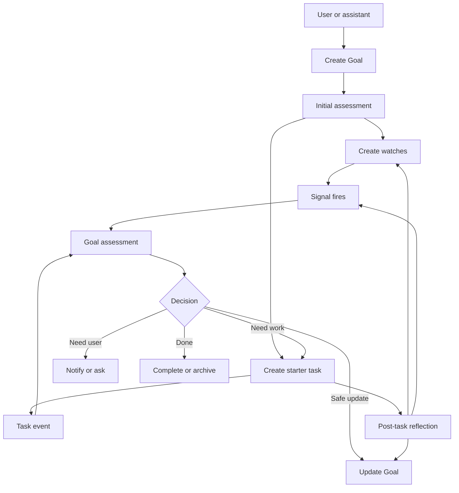

# Assistant Goals Technical Plan

This repository is building an autonomous local-first assistant. The system already has useful execution machinery: tasks, worktrees, approvals, workflows, knowledge spaces, health checks, browser UAT, memory, and a dashboard. The next product step is to make it feel alive by giving it durable objectives that it can keep caring about over time.

This document records the plan for **Goals** and proactive mode so future agents can recover the design after a restart.

## Product Thesis

Capabilities do not make an assistant feel alive by themselves. The assistant needs an obligation loop:

1. Know what the user wants over time.
2. Watch the world for relevant changes.
3. Decide whether action is needed.
4. Create work, ask the user, or update its state.
5. Report meaningful progress.
6. Learn from the result.
7. Schedule the next check.

A **Goal** is the durable object that drives this loop.

## Core Concepts

- **Goal**: A long-running objective with rich context, success criteria, constraints, cadence, autonomy, and current progress.
- **Task**: A concrete unit of work that can be delegated to the existing task supervisor.
- **Watch**: A standing condition the assistant should monitor on behalf of a Goal.
- **Signal**: A factual event that says a Goal may need attention now.
- **Note**: Durable context, progress, assumptions, and decisions for a Goal.
- **Reflection**: A small post-task or post-run assessment that updates the Goal and may create follow-up work.

Use the split deliberately:

- Create a **task** when concrete work is needed.
- Create a **watch** when something should be monitored.
- Create a **signal** when attention is needed now.
- Create a **note** when context should be remembered.
- Create a **question** when the assistant cannot safely decide.

## Goal Lifecycle



### 1. Create Goal

Goals can be created by the user or proposed by the assistant. They should capture a high-level objective and detailed operating context.

Examples:

- "Build the complicated thing X."
- "Ensure all emails are read and responded to, and give me a daily brief."
- "Keep the dashboard healthy and raise issues before they become blockers."

Required Goal fields:

```json
{
  "id": "goal_...",
  "title": "Daily email brief",
  "objective": "Ensure all important emails are read, summarised, and responded to.",
  "details": "Long-form operator intent, constraints, examples, and preferences.",
  "status": "active",
  "kind": "routine",
  "priority": "high",
  "autonomy": "propose",
  "cadence": "daily",
  "next_check_at": "2026-05-08T08:00:00Z",
  "success_criteria": [
    "Unread important emails are summarised every morning",
    "Replies are drafted for messages that need a response",
    "Nothing is sent without approval"
  ],
  "constraints": [
    "Do not send external messages without explicit approval",
    "Prefer concise summaries"
  ],
  "linked_tasks": [],
  "linked_workflows": [],
  "progress_summary": "",
  "open_questions": [],
  "last_checked_at": null
}
```

### 2. Initial Assessment

After Goal creation, the assistant should run one bounded assessment:

- Is the objective clear?
- Are credentials, permissions, or integrations missing?
- What sources should be watched?
- What recurring work exists?
- What is the first concrete next action?
- What would count as progress?
- What requires user approval?

If the Goal is unclear, the assistant asks a focused question. If it is clear, it creates watches and at most one starter task.

### 3. Create Watches

A watch tells the assistant to keep an eye on something without creating immediate work.

Example:

```json
{
  "id": "watch_...",
  "goal_id": "goal_email_brief",
  "title": "Unread important email",
  "condition": "important_unread_email_count > 0",
  "source": "email",
  "cadence": "15m",
  "severity": "medium",
  "expires_at": null,
  "on_trigger": "create_signal",
  "suggested_action": "summarise and draft replies"
}
```

Watches should be auditable and removable. They should not hide behaviour in prompts.

### 4. Generate Signals

Signals are small factual records. They can come from watches, tasks, workflows, chat, health checks, knowledge gaps, local model failures, or scheduled checks.

Example:

```json
{
  "id": "sig_...",
  "goal_id": "goal_email_brief",
  "kind": "watch_triggered",
  "summary": "3 important unread emails need review",
  "evidence": ["email:123", "email:456", "email:789"],
  "severity": "medium",
  "created_at": "2026-05-08T08:15:00Z"
}
```

A signal should not do work by itself. It should trigger a Goal assessment.

### 5. Assess Goal

The proactive loop should load due Goals and relevant signals into the assistant snapshot. For each Goal, the assistant decides one bounded action:

- `no_op`: Nothing useful to do. Record why and set the next check.
- `ask_user`: Clarification or approval is required.
- `create_task`: Concrete work is needed and allowed by autonomy.
- `run_workflow`: A safe routine can run.
- `update_goal`: Progress, blockers, questions, or watches changed.
- `raise_signal`: Something needs attention outside the current Goal.
- `complete_goal`: Success criteria are met or the Goal is obsolete.

The decision should be compiled into structured data by code. Local models should be used for small classification or ranking decisions where possible, not one large strict JSON judgement.

### 6. Create Goal-Linked Tasks

When a Goal creates a task, the task prompt must include a report-back contract.

Required task metadata:

- `goal_id`
- Goal title and objective
- Goal details relevant to the task
- success criteria
- constraints and approval rules
- current progress summary
- exact task outcome expected
- what the worker may not do
- what to report back on completion

Workers should be able to report:

- `goal.note.add`
- `goal.watch.recommend`
- `goal.signal.create`
- `goal.blocker.report`
- `goal.followup.recommend`
- `goal.progress.update`

The task agent often discovers what the assistant should keep watching. That information must not be buried in a final summary only.

### 7. Reflect After Work

After a linked task, workflow, approval, or failed run, the assistant should run a reflection:

- Did this move the Goal forward?
- Did it satisfy any success criteria?
- Did it create new risks?
- Are there new watches?
- Is another task needed?
- Should the progress summary change?
- Is the Goal blocked?
- Did the assistant learn a reusable preference?
- Should the next check time move?

Reflection should produce structured updates and candidate lessons. Durable memory changes should be reviewable unless the user has explicitly enabled automatic learning.

### 8. Notify the User

The assistant should notify only when useful:

- approval needed
- user decision needed
- brief ready
- Goal blocked
- repeated failure
- meaningful progress
- deadline risk

Everything else should be recorded in the Goal timeline.

### 9. Continue or Complete

A Goal ends when:

- success criteria are satisfied
- the user archives it
- the assistant proposes closure and the user accepts
- it becomes obsolete

Completion should produce a final summary:

- what changed
- remaining limitations
- linked tasks
- tests, UAT, and docs
- lessons learned
- ongoing watches that remain active

## Proactive Mode

Proactive mode should become safe and useful by default for local operation.

Recommended behaviour:

- Start in `observe` or `propose` autonomy.
- Run once at daemon startup.
- Run on schedule.
- Run on relevant events.
- Select due or affected Goals.
- Record a receipt for every run.
- Make provider or structured-output failures visible as assistant self-repair signals.

Every proactive run should answer:

1. Which Goals are due?
2. Which signals affect those Goals?
3. Is action needed now?
4. Is the action allowed by autonomy?
5. What did the assistant do or propose?
6. What is the next check time?

## Autonomy Model

Autonomy should be both global and per-Goal. A Goal can only narrow or explicitly opt into higher autonomy.

- `observe`: Record findings only.
- `propose`: Suggest actions and ask for approval.
- `create_tasks`: Create linked tasks without approval, but do not merge, send, delete, or externally mutate without approval.
- `execute_safe`: Run whitelisted local workflows and safe checks.
- `external_actions`: Explicit opt-in only. Sending email, messaging people, buying things, changing production state, or publishing externally require strong approval rules.

## Technical Implementation Plan

### Phase 1: Goal Storage And API

Add backend storage for Goals, Goal notes, Goal watches, Goal signals, and Goal assessments.

Suggested package shape:

- `pkg/agent/goals.go`
- `pkg/agent/goal_store.go`
- `pkg/agent/goal_assessment.go`
- `pkg/agent/goal_reflection.go`
- `pkg/agent/goal_signals.go`

Suggested data directories:

- `data/assistant_goals/goals/*.json`
- `data/assistant_goals/watches/*.json`
- `data/assistant_goals/signals/*.json`
- `data/assistant_goals/assessments/*.json`
- `data/assistant_goals/notes/*.json`

Add HTTP and CLI operations:

- create Goal
- list Goals
- show Goal
- update Goal
- pause Goal
- archive Goal
- check Goal now
- add note
- create or remove watch
- list Goal timeline

`homelabctl` should support the core flow:

```sh
homelabctl goal create
homelabctl goal list
homelabctl goal show <goal-id>
homelabctl goal check <goal-id>
homelabctl goal pause <goal-id>
homelabctl goal archive <goal-id>
```

### Phase 2: Goal-Aware Proactive Runs

Extend the assistant snapshot to include:

- active Goals
- due Goals
- recent Goal assessments
- open Goal signals
- active watches
- linked task states
- linked workflow states
- blocked Goals
- stale Goals

Change proactive scheduling so enabled mode runs at daemon startup, then on schedule and relevant events.

Assistant run outcomes should be Goal-aware:

- created linked task
- asked Goal question
- updated Goal
- snoozed Goal
- created watch
- raised signal
- completed Goal

Structured-output failures should create a signal like:

```json
{
  "kind": "assistant_self_repair",
  "summary": "Assistant proactive run returned invalid structured output",
  "severity": "high",
  "suggested_action": "Create a task to repair Assistant run structured-output handling"
}
```

### Phase 3: Task Integration

Extend task creation so tasks can carry Goal metadata.

Task prompts for Goal-linked work should include:

- Goal context block
- report-back contract
- allowed actions
- watch recommendation format
- blocker format
- expected verification

On task completion, failure, cancellation, or review rejection:

1. Create a Goal event.
2. Run Goal reflection.
3. Update progress.
4. Create follow-up signals or watches.
5. Decide whether another task is warranted.

### Phase 4: Watch And Signal Producers

Initial watch and signal producers:

- scheduled Goal due
- stale Goal with no recent progress
- linked task completed
- linked task failed
- linked workflow failed
- pending approval blocks Goal
- assistant structured-output failure
- user message mentions active Goal
- knowledge gap affects Goal
- health or supervisor issue affects Goal

Later producers:

- email unread or unreplied
- calendar upcoming event
- docs drift
- TODO or FIXME drift
- local model quality regression
- repository test failure trend
- external webhook event

### Phase 5: Dashboard Goals Surface

Add Goals to the Assistant dashboard.

Primary operator workflow:

1. See active Goals.
2. Open one Goal.
3. Understand status, next check, last action, and blockers.
4. Edit objective, details, success criteria, cadence, or autonomy.
5. Check now.
6. Pause or archive.
7. Review linked tasks, watches, signals, and notes.

Dashboard states to cover:

- loading
- empty
- active
- due
- blocked
- paused
- archived
- failed assessment
- long objective text
- many linked tasks
- mobile narrow viewport

Use existing dashboard components, spacing, semantic colour roles, and documented UI patterns.

### Phase 6: Reflection And Learning

Add reflection after:

- Goal-linked task completion
- task failure
- workflow failure
- approval rejection
- assistant run failure
- repeated user correction
- Goal completion

Reflection can create:

- progress summary update
- Goal note
- watch recommendation
- follow-up task proposal
- memory candidate
- documentation update candidate
- regression test candidate

Memory updates should be explicit or approval-gated unless the operator enables automatic learning.

### Phase 7: Routine Goals

Routine Goals should behave like durable habits.

Examples:

- daily brief
- email triage
- weekly repo health review
- nightly local model evaluation
- dashboard quality check
- knowledge gap review

Routine Goals need:

- cadence
- quiet hours
- notification preference
- last successful run
- next due time
- failure count
- catch-up behaviour

## Acceptance Criteria

The first complete version is done when:

- A user can create a Goal from CLI and dashboard.
- The proactive loop includes active Goals in its snapshot.
- A due Goal produces an assessment.
- A Goal can create a linked task.
- A linked task completion updates Goal progress.
- A task can recommend a watch or follow-up.
- A watch can create a signal.
- A signal can trigger a Goal assessment.
- Invalid assistant structured output creates a visible self-repair signal.
- The dashboard shows active Goals, status, next check, last action, linked tasks, watches, and signals.
- Tests cover storage, proactive selection, signal creation, task linking, and reflection.
- Dashboard UAT covers the Goal create/check/review workflow on desktop and mobile.

## Suggested MVP

Build this first:

1. Goal CRUD storage, API, and `homelabctl` commands.
2. Active Goals in the assistant snapshot.
3. Proactive startup check.
4. Due-Goal signal producer.
5. Four Goal actions: `no_op`, `ask_user`, `create_task`, `update_goal`.
6. Goal-linked task metadata and prompt context.
7. Post-task Goal reflection.
8. Dashboard Goal list/detail/create views.
9. Assistant self-repair signal for invalid structured output.

This MVP should make the assistant feel materially different: it will have standing objectives, check them on its own, create work from them, update progress, and explain what it is watching.

## Existing Foundation To Reuse

- Proactive Assistant runs: `pkg/agent/assistant_runs.go`
- Assistant signals: `pkg/agent/assistant_signals.go`
- Chat quality signals: `pkg/agent/chat_quality_signals.go`
- Task creation and delegation: `pkg/agent/orchestrator.go`
- Workflows: `pkg/agent/workflow.go`
- Memory: `pkg/memory`
- Dashboard Assistant page: `web/dashboard/src/routes/assistant/+page.svelte`
- Operator docs: `docs/dashboard.md`, `docs/task-workflow.md`, `docs/homelabctl.md`

## Design Guardrails

- Goals should create one good next action, not a flood of tasks.
- Watches should be visible and removable.
- Signals should be factual and concise.
- Every proactive no-op should include a reason and next check time.
- Goal autonomy should be explicit and auditable.
- External actions require explicit opt-in and strong approval rules.
- Local models should be used in bounded decisions where their output can be validated.
- Reflection should improve the system without silently rewriting memory or behaviour.

