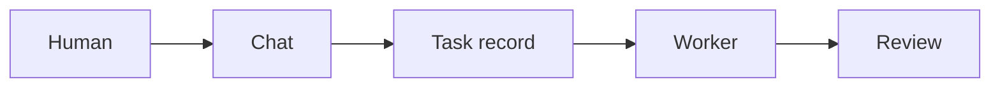

# Chat Commands

`homelabd` accepts short operational commands and natural development requests from chat.

From a terminal, use `homelabctl shell` for interactive chat-command operation, or `homelabctl message <text>` for a single message. The CLI is documented in `docs/homelabctl.md` and should be kept current with this command surface.

## Mermaid Diagrams And Brand Colours

Chat messages and dashboard docs render fenced `mermaid` and `mmd` Markdown blocks as diagrams. Use diagrams when a workflow, state machine, architecture, sequence, or user journey would be clearer for a human operator or a future agent.



The dashboard applies the homelabd diagram theme automatically and strips Mermaid theme/config init directives before rendering. Agents should not add Mermaid `init` blocks or hard-code unrelated colours. If explicit semantic styling is unavoidable outside the dashboard renderer, stay within this palette:

| Token | Light | Dark |
| --- | --- | --- |
| Canvas | `#ffffff` | `#172033` |
| Panel | `#f8fafc` | `#111827` |
| Text | `#172033` | `#dbe7f6` |
| Strong text | `#0f172a` | `#f8fafc` |
| Muted line/text | `#64748b` | `#9fb0c7` |
| Primary accent | `#2563eb` | `#60a5fa` |
| Success | `#1f6f4a` | `#1f6f4a` |
| Warning | `#b45309` | `#fde68a` |
| Danger | `#991b1b` | `#fecaca` |

## Reflection

Use reflection when you want one improvement from the recent interaction and a follow-up task you can action:

```text
reflect on our recent interaction and suggest one improvement
```

The reply includes a `new <goal>` command. In the dashboard this appears as a suggested action button, so you can create the follow-up task directly from the reflection result.

## Memory And Personality

Use memory when you want chat to carry a durable lesson into future decisions without copying your wording or tone:

```text
remember prefer concise handoffs with changed files, validation, usage, and docs status
learn from our recent interaction
memories
unlearn mem_20260428_202158_ab12cd34
unlearn concise handoffs
```

`remember` and `learn` store one distilled lesson in `memory/user.md`. When an LLM provider is configured, the agent rewrites explicit feedback into a short future-facing decision rule; without a provider it stores the supplied lesson directly. `learn from our recent interaction` requires an LLM provider because the agent must summarise chat history rather than record a raw transcript.

`memories` lists stored lesson IDs and text. `unlearn` removes lessons by ID or distinctive text. The Orchestrator also exposes `memory.list`, `memory.remember`, and `memory.unlearn` as policy-bound tools, but its prompt limits writes to explicit remember/learn/forget requests or clear future-facing feedback. Current instructions, the latest user request, and repo state always take precedence over durable memory.

## Task Creation

Use explicit task wording when you want a new durable task instead of a status summary:

```text
new add structured logging to the backup service
task: Add Playwright end-to-end tests for the chat and task components
create a task to fix running task recovery after homelabd restarts
```

`homelabd` treats `new`, `task:`, `create a task to ...`, and similar creation phrases as task creation even when the goal text mentions words like `running`, `active tasks`, or `in progress`.

New local development tasks create one queued task record and one isolated worktree. The task supervisor starts an available worker automatically, or you can run it explicitly:

```text
run <task_id>
delegate <task_id> to codex
```

Dashboard chat messages can include attachments. Use the `Attach` button on desktop or mobile, or drag files into the composer on desktop. When a chat message creates a task, the attachment metadata and text previews are included in the task context; direct dashboard help reports store the uploaded files and captured browser context on the task record.

## Task Review And Restart Gates

Use review, approval, restart, verification, and reopen commands to move local tasks through merge safely:

```text
review <task_id>
approve <approval_id>
restart <task_id>
accept <task_id>
reopen <task_id> needs rework
```

`review` records any supervised components that need a restart from the diff. After merge approval, a task with restart requirements moves to `awaiting_restart` and cannot be accepted until `homelabd` has restarted each required component through `supervisord` and seen healthy 2xx responses. Use `restart <task_id>` only when that gate has failed and needs an explicit retry.

## Workflows

Use workflows for repeatable LLM/tool logic that should live outside one chat turn:

```text
workflows
workflow new Research bundle: Find current sources and summarise risk
workflow show workflow_123
workflow run workflow_123
```

Workflows expose cost estimates for LLM calls, tool calls, waits, and runtime. The LLM can also use `workflow.create`, `workflow.list`, `workflow.show`, and `workflow.run` as policy-bound tools.

`workflow run` resumes a waiting workflow and re-checks built-in wait conditions such as `homelabd health is reachable` and `healthd reports healthy`.

## Application Errors

Supervised app stderr is captured by `supervisord`, written to `data/supervisord/logs/<app>.stderr.log`, and pushed to healthd. Use `homelabctl errors` to inspect recent entries from a terminal, or ask chat to diagnose recent application errors. The Orchestrator has the read-only `health.errors` tool and can use it with `task.create` when a root-cause fix should be tracked.

## UX Agent

Use `UXAgent` when a task changes a page, component, interaction, or visual state and needs a dedicated usability pass:

```text
ux task_123
ux task_123 check the mobile queue and touch targets
delegate task_123 to ux audit the empty, loading, keyboard, and mobile states
```

`UXAgent` works in the same isolated task worktree as `CoderAgent`, but its prompt requires current UX and accessibility research, focused UI changes, automated regression coverage, and browser-level UAT for changed UI. It should consult sources such as WCAG 2.2, WAI-ARIA APG, official framework or design-system docs, and reputable usability research before making UX decisions. Browser UAT must use the isolated task-worktree server: use `nix develop -c bun run --cwd web uat:tasks` for task-page changes and `nix develop -c bun run --cwd web uat:site` for broad shell, navigation, theme, or multi-page changes. If Chromium launch fails, run `nix develop -c bun run --cwd web browser:preflight` and report the browser infrastructure failure. It must not restart production `dashboard`, `homelabd`, `healthd`, or `supervisord`.

## Remote Agent Tasks

Remote machines are managed outside chat through the task API, dashboard, or `homelabctl`:

```text
homelabctl -addr http://127.0.0.1:18080 agent list
homelabctl -addr http://127.0.0.1:18080 agent show workstation
homelabctl -addr http://127.0.0.1:18080 task new --agent workstation --workdir repo "Update this checkout"
```

`--workdir` names an advertised workdir id. `--workdir-path` may be used for a full advertised path. Unknown workdir ids or paths are rejected so remote tasks do not silently run in a different checkout.

The chat command `agents` lists external CLI backends such as `codex`, `claude`, and `gemini`; it does not list built-in role agents such as `UXAgent`, and it is not the remote-machine inventory. Use the dashboard task queue filters or `homelabctl agent list` for remote agents.

Remote agents validate in their selected remote workdir. They should report exact test commands, ports, and URLs used, and they should not touch the control-plane supervisor for UAT.

## Search

Use repo search when you want to inspect local code:

```text
search orchestrator
```

Repo search returns grep-like context by default, including repository-relative paths and line numbers. LLM agents can also call `repo.search` directly with `workspace`, `path`, `context_lines`, and `max_results` when they need focused code context before editing.

Use web search when you need current external information:

```text
web current SvelteKit adapter-auto production deployment guidance
search the web for current SvelteKit adapter-auto production deployment guidance
search internet for Bun workspace package.json docs
```

Web search runs through the `internet.search` tool. The default web backend is SearXNG, using the hosted `https://searxng.website/` instance plus public-instance discovery from `https://searx.space/data/instances.json` when no instance is configured. Results are deduplicated across attempted instances and include source-instance metadata. Academic wording such as `academic`, `scholarly`, or `papers` searches scholarly sources.

Use environment variables when a specific SearXNG deployment is preferred:

```text
HOMELABD_SEARXNG_INSTANCES=https://search.example/,https://backup.example/
HOMELABD_SEARXNG_DISCOVERY=0
```

`HOMELABD_SEARCH_PROVIDER=searxng|brave|tavily|duckduckgo` can force a backend. `internet.search` also accepts `time_range` (`day`, `month`, or `year`) and `language` for SearXNG web searches.

Spelling and grammar cleanup runs through `text.correct`. It is a local, dependency-free helper for short English text and search queries. Direct web-search and research commands use it before searching when the tool is registered, and LLM agents can call it before `internet.search` for typo-prone natural-language queries:

```json
{"text":"kittens in pijamas","mode":"search_query","max_variants":4}
```

The result includes `corrected_text`, a correction list, and `search_queries` such as `kittens in pajamas` and `kittens in pyjamas`.

Task title summarisation runs through `text.summarize`. It is a read-only helper backed by the configured LLM provider and is used automatically when local or remote tasks are created. The Orchestrator calls it with `purpose: "task_title"` and an 84-character limit so `/tasks` rows stay scannable while the full `goal` remains on the task record:

```json
{"text":"Work this task to completion... Task goal: fix active task list labels","purpose":"task_title","max_characters":84}
```

Use research when a quick search result is not enough and the agent needs a source bundle to reason from:

```text
research current SvelteKit adapter production guidance
deep research local LLM agent web research architecture
research academic papers on deep research agents
```

Research runs through `internet.research`. It creates fan-out queries, searches web and/or academic sources, deduplicates URLs, fetches bounded text from top public pages, and returns follow-up queries. SearXNG is used for web fan-out by default. Brave, Tavily, and DuckDuckGo remain available as explicit fallbacks; Brave and Tavily require their existing API key environment variables.

## Task Worktree Recovery

External coding agents can edit files in local task worktrees, but the runtime owns git state. If a local task branch becomes too stale to reconcile cleanly, retry it first so the next worker receives the recorded failure text and the prepared conflict state:

```text
retry 793f04ec codex resolve the main-branch conflict
```

Use `refresh` only when you want to discard the old task branch work and restart from current `main`:

```text
refresh 793f04ec
delegate 793f04ec to codex implement the task again from current main
```

`refresh <task_id>` resets the task worktree branch to the current repository `main` commit and leaves the task blocked for explicit redelegation. Use it when repeated review or approval attempts report premerge conflicts from old branch state and the original task changes are no longer worth preserving.

Use `retry <task_id>` or `delegate <task_id> to codex ...` first when you want to preserve the existing task work. For conflict-resolution and premerge-failure states, `homelabd` carries the previous failure text into the worker prompt and prepares the isolated task worktree by merging current `main` when the worktree is clean. If that merge conflicts, the worker receives the actual unmerged files to resolve.

`approve <approval_id>` still executes a pending approval. For merge approvals, the Orchestrator first attempts to reconcile the task branch with current `main`; conflicts move the task to `conflict_resolution` for manual fixes and no merge is applied.

Remote tasks do not have a control-plane task worktree; use `reopen <task_id> <reason>` to queue follow-up work for the same remote target.
