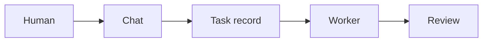

# Chat Commands

`homelabd` accepts short operational commands and natural development requests from chat.

From a terminal, use `homelabctl shell` for interactive chat-command operation, or `homelabctl message <text>` for a single message. The CLI is documented in `docs/homelabctl.md` and should be kept current with this command surface.

## Markdown And Mermaid Diagrams

Dashboard chat and docs render fenced `mermaid` and `mmd` Markdown blocks as diagrams. Agents should use Mermaid when a compact workflow, state machine, dependency graph, architecture, or handoff diagram would help a human or another machine understand the answer faster.



The dashboard applies the homelabd brand diagram palette automatically, strips Mermaid theme/config init directives before rendering, and locks theme overrides. Do not include Mermaid init directives or hard-code unrelated colours. If explicit semantic styling is unavoidable outside the dashboard renderer, stay within this palette:

| Token | Light | Dark |
| --- | --- | --- |
| Background | `#f8fafc` | `#0f172a` |
| Surface | `#ffffff` | `#111827` |
| Primary | `#2563eb` | `#60a5fa` |
| Secondary | `#0f766e` | `#2dd4bf` |
| Success | `#16a34a` | `#4ade80` |
| Warning | `#d97706` | `#fbbf24` |
| Danger | `#dc2626` | `#f87171` |
| Text | `#172033` | `#e2e8f0` |
| Muted | `#64748b` | `#94a3b8` |
| Border | `#cbd5e1` | `#334155` |

Invalid diagrams fall back to their source block so the syntax can be corrected. See [Diagramming And Brand Colours](/docs/diagramming-and-brand-colours).

## Reflection

Use reflection when you want one improvement from the recent interaction and a follow-up task you can action:

```text
reflect on our recent interaction and suggest one improvement
```

The reply includes a `new <goal>` command. In the dashboard this appears as a suggested action button, so you can create the follow-up task directly from the reflection result. Suggested task goals are not shortened before creation; the task record keeps the full brief and `homelabd` summarises only the display title.

## Chat History And Search

Use chat history commands when you want homelabd to inspect the recorded conversation rather than rely on short prompt context:

```text
history
chat history 20
chat search browser UAT
search chat for what did you tell me about workflows
```

The Orchestrator can also call `chat.history` and `chat.search` before answering questions about earlier user messages, assistant replies, what it sent, or how you responded. The LLM harness separates the prior transcript from the current request and excludes the current request from those tool results, so prompts like `what was my last message?`, `what was the third word in my last message?`, or `create a task from that interaction` can inspect the preceding exchange instead of paraphrasing the live prompt. These tools read the server event log for `user.message` and `chat.reply` entries. Dashboard chat sends a `conversation_id`, so history and search are scoped to the selected dashboard chat. CLI messages without a conversation id still use the shared unscoped history.

## Clearing And Chat Sessions

The dashboard stores resumable chat sessions in browser local storage. Use `New chat` to start a fresh local session, or select a previous chat from the history pane to continue that context. Clearing a chat removes the selected local session and asks homelabd to delete matching `user.message`, `chat.reply`, and HTTP transcript entries so future dashboard context for that chat is gone.

Use the dashboard `Clear` button for the selected chat, or `Clear all` when every local dashboard chat and all server chat transcript context should be removed. From a terminal, clear server-side chat context with:

```bash
go run ./cmd/homelabctl chat clear chat_123
go run ./cmd/homelabctl chat clear --all
```

## Memory And Personality

Use memory when you want chat to carry a durable lesson into future decisions without copying your wording or tone:

```text
remember prefer concise handoffs with changed files, validation, usage, and docs status
learn from our recent interaction
memories
unlearn mem_20260428_202158_ab12cd34
unlearn concise handoffs
```

`remember` and `learn` store one distilled lesson in `memory/user.md`. When an LLM provider is configured, the agent rewrites explicit feedback into a short future-facing decision rule; without a provider it stores the supplied lesson directly. `learn from our recent interaction` requires an LLM provider because the agent must summarise chat history rather than record a raw transcript.

`memories` lists stored lesson IDs and text. `unlearn` removes lessons by ID or distinctive text. The Orchestrator also exposes `memory.list`, `memory.remember`, and `memory.unlearn` as policy-bound tools, but its prompt limits writes to explicit remember/learn/forget requests or clear future-facing feedback. Current instructions, the latest user request, and repo state always take precedence over durable memory.

## Task Creation

Use explicit task wording when you want a new durable task instead of a status summary:

```text
new add structured logging to the backup service
task: Add Playwright end-to-end tests for the chat and task components
create a task to fix running task recovery after homelabd restarts
```

`homelabd` treats `new`, `task:`, `create a task to ...`, and similar creation phrases as task creation even when the goal text mentions words like `running`, `active tasks`, or `in progress`.

Task display titles are summarised from the requested work, not the command sugar. If a task goal reaches the API with a leading creation phrase such as `new`, `task:`, or `create a task to`, title generation ignores that lead-in before calling `text.summarize`; the task context still carries the full goal supplied by the caller.

Large homelabd feature requests, such as a new mode or product surface like Knowledge Space or Assistant, pause before implementation. OrchestratorAgent creates a concise design brief with objectives, scope, UX direction, API changes, and test strategy, then stores it as a pending `task.create` approval. No task or worktree exists until you confirm it:

```text
approve <approval_id>
refine <approval_id> start read-only and keep the first slice dashboard-only
deny <approval_id>
```

Approving the planning brief creates the implementation task and starts the worker. Refining the approval updates the brief while preserving the original request and still leaves implementation unqueued.

Open-ended chat also converts assistant commitments to implementation work into a task in the same turn. If OrchestratorAgent says it will fix, tighten, update, or improve homelabd behaviour, the reply includes the normal `/tasks?task=<task_id>` task link instead of leaving the commitment as prose.

Open-ended chat also filters LLM candidate replies that describe the agent's future process instead of answering directly. Meta sentences such as "I'll check that", "First, I'll inspect", or "I need to inspect" are removed when a concrete answer remains; meta-only replies are rejected and regenerated. If the candidate is an implementation commitment, including "I'm going to fix ...", OrchestratorAgent creates the task and returns the task link instead of the promise.

Tool-capable LLM turns use a strict response contract. The model must return exactly one raw JSON object with `message`, `done`, and `tool_calls`; unknown keys, Markdown fences, trailing prose, missing fields, `done=true` with tool calls, `done=false` without tool calls, missing tool names, and non-object `args` are rejected before any tool runs. Final answers may also include `buttons`, an optional list of up to eight concise, single-line reply choices. Dashboard chat renders those choices as buttons and sends the clicked text as the next user message. Buttons are only valid on `done=true` final answers and must be omitted on `done=false` tool-work replies; malformed labels or non-final buttons are rejected by the same Go validator. OpenAI and Gemini requests also include provider-native structured-output hints where the API supports them, but the Go validator is the authority for OpenAI, Gemini, and self-hosted providers.

Intermediate `done=false` messages are private tool-progress status. They can appear in run artifacts when a tool needs approval or a worker fails before completion, but open-ended chat only returns a `done=true` final answer to the user; if the model uses tools and never finalises, the user sees an explicit turn-limit error instead of the last progress line.

Rejected envelopes are sent back to the model with the full JSON Schema and the validation error so it can repair the response. Schema-valid but useless final replies, such as capability statements or placeholder jokes, are also rejected and recorded as `agent.response.rejected` events with the provider, model, stage, and reason. Tool arguments are validated centrally against the registered or pseudo-tool schema before policy checks and execution. Tool results are returned to the model in an explicit untrusted JSON block so web pages, command output, and tool strings cannot masquerade as instructions.

New local development tasks create one queued task record and one isolated worktree. The chat reply stays compact: it links the summarised task title to `/tasks?task=<task_id>` and notes that a worker will start automatically. The task goal itself is not clipped for display; keep important constraints in the brief and let title summarisation handle the task-list label. Opening the link selects the new task in the dashboard without a full page reload. To start or reassign the task explicitly, use:

Messages that explicitly say `no action needed`, `no action required`, or `do not create a task` are treated as notes and do not queue work, even if they accidentally start with `new`. A clear development goal such as `new fix no action needed messages` still creates a task.

```text
run <task_id>
delegate <task_id> to codex
```

Dashboard chat messages can include attachments. Use the paperclip `Attach` icon button on desktop or mobile, or drag files into the composer on desktop. When a chat message creates a task, the attachment metadata and text previews are included in the task context; direct dashboard help reports store the uploaded files and captured browser context on the task record.

Chat replies use the same Markdown renderer as `/docs`, including Mermaid fenced diagrams. Agents should include a Mermaid diagram when it makes task flow, state, dependencies, or machine context easier to understand, and should rely on the dashboard light/dark brand palette rather than inline colours. See `docs/dashboard.md#markdown-diagrams-and-brand-colours`.

## Task Review And Restart Gates

Use review, approval, restart, verification, and reopen commands to move local tasks through merge safely:

```text
review <task_id>
approve <approval_id>
approval edit <approval_id> {"target":"main"}
restart <task_id>
accept <task_id>
reopen <task_id> needs rework
```

`review` records any supervised components that need a restart from the diff. After merge approval, a task with restart requirements moves to `awaiting_restart` and cannot be accepted until `homelabd` has restarted each required component through `supervisord` and seen healthy 2xx responses. Use `restart <task_id>` only when that gate has failed and needs an explicit retry.

## Workflows

Use workflows for repeatable LLM/tool logic that should live outside one chat turn:

```text
workflows
workflow new Research bundle: Find current sources and summarise risk
workflow show workflow_123
workflow run workflow_123
```

Workflows expose cost estimates for LLM calls, tool calls, waits, and runtime. The LLM can also use `workflow.create`, `workflow.list`, `workflow.show`, and `workflow.run` as policy-bound tools.

`workflow run` resumes a waiting workflow and re-checks built-in wait conditions such as `homelabd health is reachable` and `healthd reports healthy`.

## Application Errors

Supervised app stderr is captured by `supervisord`, written to `data/supervisord/logs/<app>.stderr.log`, and pushed to healthd. Use `homelabctl errors` to inspect recent entries from a terminal, or ask chat to diagnose recent application errors. The Orchestrator has the read-only `health.errors` tool and can use it with `task.create` when a root-cause fix should be tracked.

## UX Agent

Use `UXAgent` when a task changes a page, component, interaction, or visual state and needs a dedicated usability pass:

```text
ux task_123
ux task_123 check the mobile queue and touch targets
delegate task_123 to ux audit the empty, loading, keyboard, and mobile states
```

`UXAgent` works in the same isolated task worktree as `CoderAgent`, but its prompt requires current UX and accessibility research, focused UI changes, automated regression coverage, and browser-level UAT for changed UI. It must consult `docs/ui-ux-agent-work.md`, `docs/ui-pattern-catalogue.md`, WCAG 2.2, WAI-ARIA APG, official framework or design-system docs, and reputable usability research before making UX decisions. Browser UAT must use the isolated task-worktree server: use `nix develop -c bun run --cwd web uat:ui` for focused desktop/mobile accessibility and visual checks, `nix develop -c bun run --cwd web uat:tasks` for task-page changes, and `nix develop -c bun run --cwd web uat:site` for broad shell, navigation, theme, or multi-page changes. If Chromium launch fails, run `nix develop -c bun run --cwd web browser:preflight` and report the browser infrastructure failure. It must not restart production `dashboard`, `homelabd`, `healthd`, or `supervisord`.

## Remote Agent Tasks

Remote machines are managed outside chat through the task API, dashboard, or `homelabctl`:

```text
homelabctl -addr http://127.0.0.1:18080 agent list
homelabctl -addr http://127.0.0.1:18080 agent show workstation
homelabctl -addr http://127.0.0.1:18080 task new --agent workstation --workdir repo "Update this checkout"
```

`--workdir` names an advertised workdir id. `--workdir-path` may be used for a full advertised path. Unknown workdir ids or paths are rejected so remote tasks do not silently run in a different checkout.

The chat command `agents` lists external CLI backends such as `codex`, `claude`, and `gemini`; it does not list built-in role agents such as `UXAgent`, and it is not the remote-machine inventory. Use the dashboard task queue filters or `homelabctl agent list` for remote agents.

Remote agents validate in their selected remote workdir. They should report exact test commands, ports, and URLs used, and they should not touch the control-plane supervisor for UAT.

## Search

Use tool introspection when you want the current policy-bound tool catalogue from chat without asking the LLM to infer it:

```text
tools
what tools are available?
```

The reply lists registered tools and Orchestrator pseudo-tools with a short description and top-level required or optional parameters. For the fuller policy model, schemas, examples, and limits, see `docs/agent-tools.md`.

Use repo search when you want to inspect local code:

```text
search orchestrator
```

Repo search returns grep-like context by default, including repository-relative paths and line numbers. LLM agents can also call `repo.search` directly with `workspace`, `path`, `context_lines`, and `max_results` when they need focused code context before editing.

The complete agent tool argument reference, policy model, and tool limitations are documented in `docs/agent-tools.md`.

Use web search when you need current external information:

```text
web current SvelteKit adapter-auto production deployment guidance
search the web for current SvelteKit adapter-auto production deployment guidance
search internet for Bun workspace package.json docs
```

Web search runs through the `internet.search` tool. The default web backend is SearXNG, using the hosted `https://searxng.website/` instance plus public-instance discovery from `https://searx.space/data/instances.json` when no instance is configured. Results are deduplicated across attempted instances and include source-instance metadata. Academic wording such as `academic`, `scholarly`, or `papers` searches scholarly sources.

Use environment variables when a specific SearXNG deployment is preferred:

```text
HOMELABD_SEARXNG_INSTANCES=https://search.example/,https://backup.example/
HOMELABD_SEARXNG_DISCOVERY=0
```

`HOMELABD_SEARCH_PROVIDER=searxng|brave|tavily|duckduckgo` can force a backend. `internet.search` also accepts `time_range` (`day`, `month`, or `year`) and `language` for SearXNG web searches.

Spelling and grammar cleanup runs through `text.correct`. It is a local, dependency-free helper for short English text and search queries. Direct web-search and research commands use it before searching when the tool is registered, and LLM agents can call it before `internet.search` for typo-prone natural-language queries:

```json
{"text":"kittens in pijamas","mode":"search_query","max_variants":4}
```

The result includes `corrected_text`, a correction list, and `search_queries` such as `kittens in pajamas` and `kittens in pyjamas`.

Task title summarisation runs through `text.summarize`. It is a read-only helper backed by the configured LLM provider and is used automatically when local or remote tasks are created. The Orchestrator calls it with `purpose: "task_title"` and an 84-character limit so `/tasks` rows stay scannable while the full `goal` remains on the task record:

```json
{"text":"Work this task to completion... Task goal: fix active task list labels","purpose":"task_title","max_characters":84}
```

Use research when a quick search result is not enough and the agent needs a source bundle to reason from:

```text
research current SvelteKit adapter production guidance
deep research local LLM agent web research architecture
research academic papers on deep research agents
```

Research runs through `internet.research`. It creates fan-out queries, or uses explicit `queries` supplied by a caller, searches web and/or academic sources, deduplicates URLs, fetches bounded text from top public pages, and returns follow-up queries. SearXNG is used for web fan-out by default. Brave, Tavily, and DuckDuckGo remain available as explicit providers; Brave and Tavily require their existing API key environment variables.

## Task Worktree Recovery

External coding agents can edit files in local task worktrees, but the runtime owns git state. If a local task branch becomes too stale to reconcile cleanly, retry it first so the next worker receives the recorded failure text and the prepared conflict state:

```text
retry 793f04ec codex resolve the main-branch conflict
```

Use `refresh` only when you want to discard the old task branch work and restart from current `main`:

```text
refresh 793f04ec
delegate 793f04ec to codex implement the task again from current main
```

`refresh <task_id>` resets the task worktree branch to the current repository `main` commit and leaves the task blocked for explicit redelegation. Use it when repeated review or approval attempts report premerge conflicts from old branch state and the original task changes are no longer worth preserving.

Use `retry <task_id>` or `delegate <task_id> to codex ...` when you want to preserve the existing task work and force an immediate worker attempt. The task supervisor also starts automatic recovery for conflict-resolution and retryable premerge-failure states. In both paths, `homelabd` carries the previous failure text into the worker prompt and prepares the isolated task worktree by merging current `main` when the worktree is clean. If that merge conflicts, the worker receives the actual unmerged files to resolve.

`approve <approval_id>` still executes a pending approval. For merge approvals, the Orchestrator first attempts to reconcile the task branch with current `main`; conflicts move the task to `conflict_resolution`, automatic recovery is queued, and no merge is applied. Re-approving an already failed merge approval queues recovery or review instead of reporting the dead approval as granted.

`approval edit <approval_id> <json_args>` replaces the arguments on a pending approval before it is granted. The new args must be one JSON object and must pass the tool schema; successful edits are logged as `approval.edited`.

`llm quality [YYYY-MM-DD]` summarises model turns, schema rejections, semantic rejections, token totals, and tool-argument validator denials from the event log. Use it when comparing OpenAI, Gemini, Ollama, or self-hosted provider behaviour after a poor response.

Remote tasks do not have a control-plane task worktree; use `reopen <task_id> <reason>` to queue follow-up work for the same remote target.
