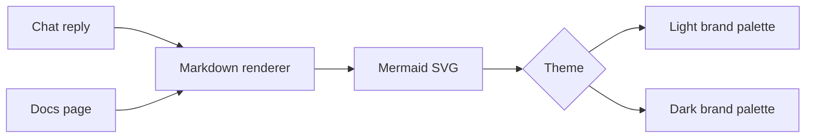

# Dashboard

The dashboard has these primary operator surfaces:

- `/chat`: global conversation, broad direction, planning, and general commands.
- `/tasks`: task queue, selected-task record, task actions, and task-scoped activity.
- `/workflows`: durable LLM/tool workflow creation, cost estimates, run status, and latest outputs.
- `/docs`: searchable documentation library generated from Markdown files in `./docs`.
- `/terminal`: browser terminal backed by a homelabd shell session for direct operator commands.
- `/supervisord`: supervised application status and start, stop, restart controls.
- `/healthd`: healthd service status, system utilization, checks, SLOs, and notifications.

Do not collapse these into one surface. Chat and tasks represent different mental models.
Healthd is also deliberately separate: its API is served by the `healthd` Go service, not by `homelabd`.

Agent browser testing is deliberately separate from the supervised dashboard. Use `nix develop -c bun run --cwd web uat:tasks` for task-page UAT and `nix develop -c bun run --cwd web uat:site` for broad dashboard shell, navigation, theme, terminal, docs, workflow, health, or supervisor changes. Both start an isolated Playwright/Vite server from the task worktree and use mocked APIs. Do not restart the production dashboard or `homelabd` stack for agent validation. See `docs/agentic-testing.md`.

## Navigation

Use the shared responsive navbar on every dashboard page.

- Desktop and tablet: show primary destinations inline because visible navigation is more discoverable than hidden navigation.
- Mobile: collapse destinations behind a labelled `Menu` hamburger button to preserve content width.
- Mobile: keep the `Help` button next to `Menu`. It captures browser context, asks for screen-capture permission when the browser supports it, prompts for a short bug note, and creates a task with the captured attachments.
- Always include text labels. The hamburger glyph is a space-saving cue, not the only signifier.
- Keep top-level destinations flat: `Chat`, `Tasks`, `Workflows`, `Docs`, `Terminal`, `Supervisor`, and `Health`.
- Show active page state with `aria-current="page"` and visible styling.

## Documentation Library

The `/docs` page imports every Markdown file under `./docs` into the dashboard. It shows a searchable, grouped document catalogue, selected document content, heading anchors, an on-page table of contents, and previous/next document links. Keep document titles specific and include the terms operators and LLM agents are likely to search for.

- Desktop: keep local documentation navigation visible on the left, but compact enough that the selected document and on-page table of contents remain the primary reading surface.
- Mobile: avoid horizontal document carousels. Show a labelled document jump control, visible search, and a vertical document list so operators can discover other pages without guessing that content is off-screen.
- Search filters titles, paths, summaries, and full Markdown content. Search results show summaries; the default browse view uses short labels for faster scanning.
- Mermaid fenced diagrams render in docs and chat. The renderer applies the shared homelabd light or dark diagram palette, keeps the original source as a code fallback when rendering fails, and prevents diagram-level theme overrides from replacing the brand colours.

## Markdown Diagrams And Brand Colours

Chat replies and docs pages render Mermaid fenced blocks. Use diagrams when a state machine, workflow, queue, dependency graph, or handoff is easier to scan visually than as prose.



Agents should write plain Mermaid and let the dashboard apply the brand palette. Avoid inline colours unless a diagram has a specific semantic need.

- Light palette: `background #f8fafc`, `surface #ffffff`, `primary #2563eb`, `secondary #0f766e`, `success #16a34a`, `warning #d97706`, `danger #dc2626`, `text #172033`, `muted #64748b`, `border #cbd5e1`.
- Dark palette: `background #0f172a`, `surface #111827`, `primary #60a5fa`, `secondary #2dd4bf`, `success #4ade80`, `warning #fbbf24`, `danger #f87171`, `text #e2e8f0`, `muted #94a3b8`, `border #334155`.

## Research Inputs

- Apple split-view guidance: keep navigation and detail panes visibly related, preserve the current selection, and avoid forcing split panes into compact mobile widths.
- Android and Material responsive guidance: use list-detail on wide screens, then adapt to one stacked destination on compact screens.
- Material navigation guidance: use drawers for compact layouts and keep primary navigation destinations consistent across layouts.
- NN/g menu guidance: visible navigation performs better for discoverability; hidden hamburger navigation should be reserved for constrained space.
- Mintlify documentation navigation guidance: organise docs around user goals, keep top-level choices concise, and promote important content before it becomes buried.
- Docusaurus and Starlight documentation patterns: use sidebars to group related documents, show common navigation across pages, and pair page content with an on-page table of contents.
- Algolia DocSearch guidance: search should be purpose-built for documentation, keyboard-accessible, and able to surface technical content quickly.
- Nielsen Norman usability heuristics: always expose system status, speak the operator's language, and keep clear exits for wrong actions.
- Atlassian/Jira issue views: work-item detail pages have top-level issue actions and an activity feed containing changes, comments, history, and related updates.
- Slack threads and incident-command tools: conversations need explicit context boundaries; task or incident timelines prevent important work from being buried in a global chat scroll.
- Atlassian dashboard and status guidance: centralize task visibility, make bottlenecks obvious, use semantic colour roles, and pair colour with text.
- GitHub pull request diffs: review should compare topic-branch changes against the base branch, offer unified and split views, show additions in green and deletions in red, and use three-dot comparison to focus on what the task branch introduces.
- GitLab merge request reviews: the changes view is the primary review surface, with review status and merge checks kept close to the diff.
- CodeMirror and Monaco diff APIs: mature web diff viewers support hidden unchanged regions, gutters, syntax-aware deleted text, inline change highlighting, and unified or side-by-side review modes.
- Marker.io and Sentry feedback widgets: bug reporting should be available in context, attach screenshots, collect useful browser state, and ask the user for the missing human detail before submission.
- MDN Screen Capture API guidance: web pages must request screen capture through `getDisplayMedia()`, which prompts the user to select and grant capture permission.
- Jira attachment guidance: work items can carry files and screenshots when attachments are enabled, and the issue view should make attached evidence visible.

Sources:

- https://developer.apple.com/design/human-interface-guidelines/split-views
- https://developer.apple.com/design/human-interface-guidelines/sidebars
- https://developer.android.com/develop/ui/views/layout/build-responsive-navigation
- https://m1.material.io/patterns/navigation-drawer.html
- https://m1.material.io/layout/structure.html
- https://media.nngroup.com/media/articles/attachments/PDF_Menu-Design-Checklist.pdf
- https://www.mintlify.com/docs/guides/navigation
- https://docusaurus.io/docs/sidebar
- https://starlight.astro.build/guides/sidebar/
- https://docsearch.algolia.com/
- https://www.nngroup.com/articles/ten-usability-heuristics/
- https://www.nngroup.com/articles/visibility-system-status/
- https://developer.atlassian.com/cloud/jira/platform/issue-view/
- https://support.atlassian.com/jira-software-cloud/docs/what-are-the-different-types-of-activity-on-an-issue/
- https://slack.com/help/articles/115000769927-Use-threads-to-organize-discussions
- https://www.atlassian.com/incident-management/postmortem/timelines
- https://docs.aws.amazon.com/incident-manager/latest/userguide/tracking.html
- https://docs.firehydrant.com/docs/incident-timeline
- https://atlassian.design/foundations/color
- https://atlassian.design/components/lozenge/
- https://www.atlassian.com/agile/project-management/task-management-dashboard
- https://docs.github.com/en/pull-requests/collaborating-with-pull-requests/proposing-changes-to-your-work-with-pull-requests/about-comparing-branches-in-pull-requests
- https://docs.gitlab.com/user/project/merge_requests/reviews/
- https://codemirror.net/docs/ref/#merge.unifiedMergeView
- https://microsoft.github.io/monaco-editor/typedoc/interfaces/editor.IDiffEditorConstructionOptions.html
- https://marker.io/features/website-feedback-widget
- https://sentry.io/changelog/user-feedback-widget-screenshots/
- https://developer.mozilla.org/en-US/docs/Web/API/MediaDevices/getDisplayMedia
- https://support.atlassian.com/jira-cloud-administration/docs/configure-file-attachments/

## Layout Rationale

Every visible component must answer one of these questions:

For `/tasks`, every visible component must answer one of these questions:

1. What needs my attention?
2. What is running?
3. What task am I looking at?
4. What is the safest next action?
5. What happened on this task?

For `/chat`, every visible component must answer one of these questions:

1. What did I tell homelabd?
2. What did homelabd say back?
3. Which generated command can I safely click?
4. Where do I go to inspect task state?

For `/workflows`, every visible component must answer one of these questions:

1. What workflow can I reuse?
2. What will it cost in LLM calls, tool calls, waits, and estimated runtime?
3. Which step is encoded?
4. What happened on the latest run?

If a component does not answer one of those questions, it should not be in the primary surface.

## Component Placement

- `/tasks` left pane: task queue. It is the navigation model, because the operator supervises work by task rather than by chat transcript.
- Top-left header: system identity, sync freshness, and manual sync. This answers whether the view is current. The `Synced` timestamp includes seconds so a manual reload is visible even when repeated within the same minute.
- Triage buttons: `Needs action`, `Running`, and `All`. The page opens on `Needs action` because this page is primarily an operator console; `All` remains one tap away for audit and search. The buttons double as counts and filters so the operator can shift attention without extra controls.
- Search field: below triage because search is secondary; first the operator needs to see urgent work, then find specific work.
- Task list: appears immediately after search. Rows are the main navigation and must stay fast to scan even when remote queues are present. Approval state belongs on the task row and in the selected task decision panel, not in a separate queue pop-out.
- Task rows: coloured dot plus text status. Colour gives scan speed; text keeps it accessible and unambiguous.
- Right pane: selected task record. It is not a chat transcript and has no task chat composer. Selecting a different task changes the record, summary, result, action buttons, diff, worker trace, and activity timeline.
- Manual `Sync` refreshes tasks, approvals, events, and remote agents first, then refreshes selected-task worker runs and the local diff without blocking the queue from becoming current.
- Task sync failures are shown inside the task pane. The queue must never make a failed `/api/tasks` request look like a real empty result.
- Selected task title: use the stored compact task title generated at creation time, so long prompts do not dominate the queue or the top of the record. The original input remains available in the detail disclosures.
- Task summary: ID, status, owner, started time, runtime, and update time. Keep this as a compact metadata strip, not separate cards; it identifies the selected object without taking attention away from the decision.
- Decision panel: one emphasised workflow-forward button derived from task state. Retry/reopen inputs and secondary task endpoint buttons live inside this same panel so the operator sees one coherent action area. A task in `awaiting_restart` shows restart progress instead of an accept button; if the gate fails, `Retry restart` calls the typed restart endpoint. Conflict-resolution tasks can still be retried directly, but the primary copy must make clear that automatic recovery is owned by the task supervisor. Do not build task-page buttons by sending chat messages or natural-language commands to `/message`.
- Secondary actions: low-emphasis direct endpoint buttons such as retry, reopen, stop, delete, or deny approval. Destructive actions must remain visually distinct from constructive actions.
- Retry and reopen forms: short, task-scoped inputs for optional retry instruction or reopen reason. These are structured payloads sent to typed task endpoints.
- State and context: workflow state, automatic recovery attempt count, workspace path, post-merge restart status, remote execution context, and stored result are grouped together. Remote execution context must repeat machine, agent, backend, and full directory path because remote tasks may run outside this repo and a wrong target can damage the wrong checkout.
- Attachments: selected task records show attached evidence inside `State and context`. Image attachments get a thumbnail and download link; text/context attachments show an inline preview. Keep this visible near state because bug-report attachments explain why the task exists.
- Changes vs main: task-scoped diff review loaded from `GET /tasks/{task_id}/diff`. It shows the branch comparison, summary counts, changed-file navigation, split/unified toggles, line numbers, addition/deletion colour, wrapped long lines, and inline changed-text highlights. On medium-width screens the file list moves above the diff, and split mode keeps readable code width inside the diff scroller rather than compressing side-by-side columns. Use this before review, conflict-resolution delegation, or approval.
- Long diagnostics: worker trace, task activity, reviewed plan, and original input use disclosures. Keep the summary line meaningful, because operators often need to scan the result and only expand a long section when investigating a failure or review detail.
- `/chat` page: single global transcript and composer. It does not show selected task detail because selecting tasks and typing chat commands are separate jobs.
- `/chat` attachments: the composer supports desktop file picking, mobile file picking, and drag-and-drop into the composer. Attachment chips show the file name, media type, and size before send; sent messages keep visible attachment metadata. The API receives attachment data with the chat message so task-creation commands and LLM context can include the uploaded evidence.
- Help task capture: the mobile navbar `Help` button records the current URL, page title, viewport, visible page text, active element, selected text, and recent click/change actions. It attempts a screenshot through the browser screen-capture permission flow and then opens a dialog for the operator's extra detail. `Submit help task` creates a normal local task with `browser-context.json` and any screenshot as task attachments.
- Cross-page links: `/chat` links to `/tasks`, and `/tasks` links back to `/chat`, so the operator can switch modes deliberately.

## Status Semantics

- Queued: the task exists and is waiting in its execution queue. Local tasks have isolated worktrees and wait for the local task supervisor; remote tasks wait for the selected `homelab-agent`.
- Running: an in-memory local worker or a remote agent is active.
- Red: failed, blocked, or conflict resolution. Recovery is needed; retryable local failures are requeued automatically, while exhausted, dependency-blocked, or terminal failures need intervention.
- Amber: ready for review, awaiting approval, awaiting restart, or awaiting verification. Needs a human decision or a visible gate before final acceptance.
- Blue: queued or running. Work is active.
- Green: done. No action required unless the result is wrong.
- Gray: unknown or neutral state.

Do not rely on colour alone. Always show the status text next to the coloured indicator.

## Network Resilience

Dashboard API reads are retry-tolerant for commute-grade connections. The shared web client retries safe `GET` and `HEAD` requests after transient fetch failures, `408`, `429`, and `5xx` responses, with a short backoff. Unsafe writes such as chat commands, task creation, cancellation, and retries are not automatically replayed because they can change server state.

The `/tasks` page coalesces refreshes: if a slow sync is still in flight, the next manual or scheduled sync waits for the same result instead of starting another batch. Keep existing task data visible during a failed refresh so operators can continue reading the last known state.

## Task Supervisor

`homelabd` owns task liveness; the UI should not make the operator babysit worker state.

- New tasks start as `queued`, not `running`, until a worker is actually assigned.
- The task supervisor periodically scans the durable task store and starts queued work with the preferred external worker, currently `codex` when configured.
- The task supervisor runs review for local `ready_for_review` tasks, requeues `awaiting_approval` tasks that no longer have a pending merge approval, and queues automatic recovery for `conflict_resolution` plus retryable `blocked` states.
- Automatic recovery is bounded to three attempts with a cooldown. Attempts are written to the task record and shown in `State and context`.
- On boot, persisted `running` tasks are recovered because in-memory worker state cannot survive a process restart.
- During normal operation, stale `running` tasks with no in-memory owner are retried after `limits.task_stale_seconds`.
- Supervisor activity is logged with `slog` and appended to the event log using `task.supervisor.*` or `task.recovery.*` events.
- Remote-targeted tasks are not picked up by the local task supervisor. They stay in the queue for the selected `homelab-agent`, and review does not compare the remote checkout against the control-plane repo.

## Task Queues

The Tasks page separates work by execution queue:

- `All queues` shows every task.
- `Local homelabd` shows tasks that run in local homelabd worktrees.
- Each remote agent gets its own queue, named by agent display name and machine.

Remote task creation is deliberately explicit. The "New task target" panel shows the selected agent, machine, and full directory path, and the create button remains disabled until the context confirmation checkbox is checked. Treat that checkbox as the final guard against running an agent in the wrong checkout. The API rejects unknown workdir ids or paths for registered agents, so a stale UI selection should fail instead of silently falling back.

The `Needs action` tab shows tasks that need an operator decision, failed work, review, approval, verification, or conflict resolution. Legacy task graph parent records or child phases blocked only by an earlier graph phase are hidden from this tab, but remain visible in `All` and search for auditability.

Remote task detail pages repeat the execution context in an amber "Remote execution context" block. Verify that machine and path before asking for follow-up work.

Local tasks use isolated local worktrees. Remote tasks do not create local worktrees and do not compare their repository state against the control-plane repo.

## Mobile Behavior

On compact screens `/tasks` stacks:

1. `Queue` is the parent view. It shows filters, search, task rows, execution queues, and new-task creation.
2. Tapping a task opens the selected task record as a child view.
3. The selected task record starts at the top, shows the decision panel first, and exposes a clear `Back to queue` control.
4. Long diagnostic sections start collapsed so a phone user can inspect state, actions, and diff before expanding worker output or history.

The split view is not forced into a narrow screen because that makes task names, task details, and command output harder to read. Do not add a separate `Task` tab for the current selection; it behaves like saved state rather than navigation and is easy to misread. The Tasks page does not render a global command panel on mobile.

On compact screens `/chat` remains a single-column conversation because there is no task-detail pane on that page.

On compact screens `/terminal` keeps the xterm viewport as the primary scroll area and places large control-key buttons below it. Include controls for keys commonly missing or awkward on Android keyboards, including `Ctrl-C`, `Ctrl-D`, `Ctrl-Z`, `Tab`, `Esc`, and arrow keys.

## Terminal Runtime

The Terminal page uses homelabd HTTP endpoints under `/terminal/sessions`, proxied by the dashboard as `/api/terminal/sessions` during development. Creating a session starts `./run.sh shell` when an executable `run.sh` exists in the homelabd working directory; otherwise it starts the user's shell inside a Linux PTY. When `tmux` is available, homelabd starts the shell inside a hidden tmux session and attaches the browser PTY to it, so the dashboard can reload and reattach without losing the running shell. `GET /terminal/sessions/{id}` reattaches homelabd to an existing tmux-backed session and returns current metadata.

The browser renders each session with xterm.js, streams terminal output over `GET /terminal/sessions/{id}/events`, sends keyboard input with `POST /terminal/sessions/{id}/input`, and sends terminal resize updates with `POST /terminal/sessions/{id}/resize`. The event stream includes SSE event ids, a reconnect hint, and keepalive comments. Clients reconnect from the last seen event after mobile sleep, tab switching, or brief network loss; input typed while reconnecting is queued per tab and flushed once the same session is reachable again. `GET /terminal/sessions/{id}/ws` remains available for WebSocket clients.

Do not strip ANSI or terminal control sequences in the dashboard. The PTY byte stream is intentionally passed to xterm.js so colours, cursor movement, prompts, tab completion, and full-screen CLI programs behave like a real terminal. Keyboard input should go directly into the xterm viewport, not through a separate command composer.

The Terminal page has persistent tabs. Use the `+` button beside the session target picker to add a shell, click an inactive tab once to switch to it, click the active tab name to rename it, and close a tab to delete its backend session. Reloading the dashboard, navigating away, or locking a phone detaches the browser transport only; it keeps local tab metadata and reattaches to the stored session ids. A transient network or API failure while reattaching keeps the stored session id and retries; only a `404` from `/terminal/sessions/{id}` means the stored backend session is gone and a replacement may be created. The session target picker chooses the target for the next new tab: `homelabd local` opens a PTY on the control plane, while online remote agents appear when their heartbeat metadata includes `terminal_base_url`.

This is an operator shell. Run it only where the homelabd HTTP API is already trusted, because anyone who can reach the endpoint can execute commands as the homelabd process user.

## Healthd Runtime

Run healthd as its own process:

```bash
./run.sh build-healthd ./.bin/healthd
./.bin/healthd
```

The default healthd API address is `127.0.0.1:18081`. During dashboard development, Vite proxies `/healthd-api/*` to that process. A `500 Internal Server Error` from `/healthd` usually means the dashboard is running but `healthd` is not listening on `127.0.0.1:18081`.

`homelabd` sends a heartbeat to `POST /healthd/processes/heartbeat` when healthd is enabled, then repeats every `healthd.process_heartbeat_interval_seconds`. Healthd lists announced processes in the `/healthd` snapshot and turns stale heartbeats into `process:<name>` check failures after `healthd.process_timeout_seconds`, so the Health page shows `homelabd` alongside configured HTTP checks and future monitored processes.

`supervisord` sends application stderr lines to `POST /healthd/errors` after writing them to per-app stderr logs. Use `GET /healthd/errors` or `homelabctl errors` to review recent application errors before creating root-cause tasks.

Remote agents are also represented as healthd processes. `homelabd` forwards accepted remote-agent heartbeats as `remote-agent:<agent_id>` with type `remote_agent`, machine metadata, service instance identity, current task id, advertised workdir count, and a TTL based on `control_plane.agent_stale_seconds`.
