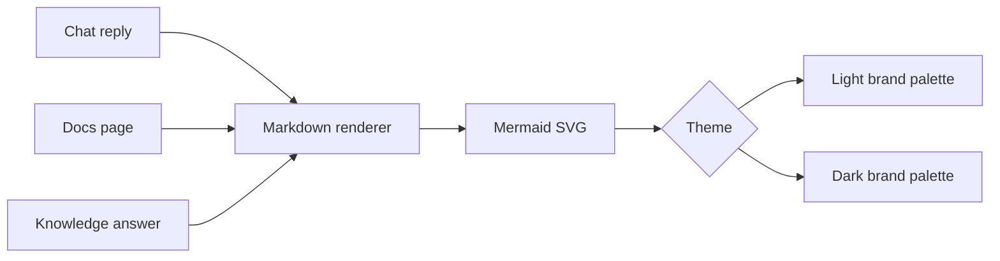

# Dashboard

The dashboard has these primary operator surfaces:

- `/assistant`: durable Goals, proactive Assistant runs, signal inbox, capability routes, recommendation decisions, returned receipts, evidence snapshots, and a compact link to Assistant capability documentation.
- `/chat`: resumable conversations, broad direction, planning, and general commands.
- `/tasks`: task queue, selected-task record, task actions, execution-target creation, and task-scoped activity.
- `/knowledge`: Knowledge Space source corpora, ingestion status, corpus ask/search, research runs, and source-grounded artefacts.
- `/workflows`: durable LLM/tool workflow creation, cost estimates, run status, and latest outputs.
- `/docs`: searchable documentation library generated from Markdown files in `./docs`.
- `/terminal`: browser terminal backed by a homelabd shell session for direct operator commands.
- `/supervisord`: supervised application status and start, stop, restart controls.
- `/healthd`: healthd service status, system utilization, checks, SLOs, and notifications.

Do not collapse these into one surface. Chat and tasks represent different mental models.
Healthd is also deliberately separate: its API is served by the `healthd` Go service, not by `homelabd`.

Agent browser testing is deliberately separate from the supervised dashboard. Use `nix develop -c bun run --cwd web uat:tasks` for task-page UAT and `nix develop -c bun run --cwd web uat:site` for broad dashboard shell, navigation, theme, terminal, docs, workflow, health, or supervisor changes. Both start an isolated Playwright/Vite server from the task worktree and use mocked APIs. Do not restart the production dashboard or `homelabd` stack for agent validation. See `docs/agentic-testing.md`.

For dashboard UI/UX changes, agents must start from the brief, reuse, state coverage, accessibility, and screenshot-review workflow in `docs/ui-ux-agent-work.md`, using `docs/ui-pattern-catalogue.md` as the dashboard pattern source.

## Progressive Web App

The dashboard is installable as a Progressive Web App from HTTPS, `localhost`, or `127.0.0.1`. The app shell links `/manifest.webmanifest`, app icons, iOS web-app metadata, theme colours, and a SvelteKit service worker from `web/dashboard/src/service-worker.ts`. Production builds register the service worker; dev-server UAT keeps registration off so cached workers cannot affect mocked browser tests. When Chromium exposes `beforeinstallprompt`, the navbar shows an `Install` action. Browser-level install controls such as Add to Dock or Add to Home Screen remain valid when the browser does not expose that event.

The service worker precaches built SvelteKit assets, static assets, icons, the manifest, and `/offline.html`. Page navigations use network-first caching so a previously loaded shell can reopen during a brief disconnect, then fall back to the offline page. Live operational endpoints under `/api`, `/healthd-api`, and `/supervisord-api` bypass the service worker, and non-GET requests are never replayed, because stale task, terminal, health, or supervisor data is worse than unavailable data.

New service workers that replace an existing dashboard worker activate promptly, claim dashboard tabs, and refresh same-origin dashboard clients so a normal browser profile cannot stay pinned to old JavaScript after a deployment. When a browser still reports a waiting worker before activation, the navbar shows `Update`; clicking it sends the service worker a `SKIP_WAITING` message and reloads after `controllerchange`. Clearing dashboard local state does not clear the service worker cache, so update recovery must happen through the worker lifecycle rather than relying on chat or task state resets.

Validate PWA metadata with `nix develop -c bun run --cwd web uat:site`. For a production service-worker check, build and serve the dashboard from the task worktree, then verify `/chat` registers `/service-worker.js`, that `/manifest.webmanifest`, the 192px icon, 512px icon, and maskable 512px icon load successfully, and that a newer build either refreshes the controlled dashboard tab after activation or surfaces the `Update` action before reload.

## Navigation

Use the shared responsive navbar on every dashboard page.

- Desktop and tablet: show primary destinations inline because visible navigation is more discoverable than hidden navigation.
- Constrained widths: collapse destinations behind a labelled `Menu` hamburger button to preserve content width. When the compact menu is open, dim the page with a scrim and close the menu when the operator taps outside the menu or selects a destination.
- Keep the `Help` button visible on desktop, tablet, and mobile. It captures browser context, asks for screen-capture permission only when the browser and page security context support it, prompts for a short bug note, and creates a task with the captured attachments. If inline navigation would crowd the bar, collapse destinations behind `Menu` before hiding `Help`.
- Always include text labels. The hamburger glyph is a space-saving cue, not the only signifier.
- Keep top-level destinations flat: `Assistant`, `Chat`, `Tasks`, `Knowledge`, `Workflows`, `Docs`, `Terminal`, `Supervisor`, and `Health`.
- Show active page state with `aria-current="page"` and visible styling.
- Show compact Tasks attention badges only when action is needed. Red counts failed, timed-out, blocked, or conflict-resolution items; orange counts review, approval, restart, verification, or standalone approval items. Keep the badges small, cap large numbers as `99+`, and expose the same count in the link label so the signal is not colour-only.
- Keep the navbar pinned to the viewport top on pages with internal scroll regions, including `/chat`, so mobile and desktop operators can reach navigation without first scrolling the conversation.

## Loading Performance

Dashboard list routes must stay lightweight. Task lists, Assistant run lists, Knowledge Space lists, and event lists are overview data: they preserve ids, status, counts, summaries, and short previews, but omit large stored bodies such as task results, remote diffs, raw diff snapshots, attachment data, Assistant run snapshots, Knowledge source content, research chunks, and oversized event payloads. The shared navbar must use `GET /tasks/attention` for the Tasks badge instead of fetching the task list and approvals on every page. Task and Assistant run stores maintain list-summary sidecars as records are saved, and legacy records backfill those sidecars the first time a list is requested. Event lists with `limit=N` read from the tail of the day's JSONL log instead of parsing the whole file. Selected records load complete detail through the existing record endpoints: `GET /tasks/<task_id>`, `GET /assistant/runs/<run_id>`, and `GET /knowledge/spaces/<space_id>`.

Use `detail=full` only for diagnostics that explicitly need a complete list payload. Dashboard pages should not depend on full list payloads because old completed tasks, proactive runs, and event logs can grow into hundreds of megabytes.

## URL References

Dashboard state that operators naturally share must have a URL and must use SvelteKit navigation, not full document reloads.

- Task rows and chat-created task links use `/tasks?task=<task_id>` and open the selected task record. Chat task creation replies display the summarised task title as the link text.
- Plain `/tasks` is the task queue overview and does not auto-select the first task. From the overview, selecting a task pushes `/tasks?task=<task_id>`, so browser Back returns to the overview instead of another task detail.
- Returning from a task record preserves the active task triage and execution-queue filters. Direct task links fall back to `All` only when the task is hidden by the current queue context.
- Knowledge Space rows use `/knowledge?space=<space_id>` and open the selected research corpus. Panel tabs use stable hashes such as `#knowledge-panel-sources`, `#knowledge-panel-runs`, and `#knowledge-panel-artefacts`. Sources, research runs, reports, references, prompts, gaps, loops, coverage records, candidates, and events append stable `#knowledge-*` hashes so shared links restore the relevant tab, selected record, disclosure, and scroll position. Background sync must update data in place without re-scrolling an already-applied anchor.
- Workflow rows use `/workflows?workflow=<workflow_id>` and open the selected workflow detail.
- Terminal tabs use `/terminal?session=<terminal_session_id>` once a backend session exists, or `/terminal?tab=<tab_id>` before startup.
- Docs use `/docs/<slug>` plus heading hashes, for example `/docs/task-workflow#browser-uat`.
- Chat messages expose hash links such as `/chat#message-assistant-2`.
- Assistant proactive output lives at `/assistant`, and selected runs use stable URLs such as `/assistant?run=<assistant_run_id>` or `/assistant?view=archived&run=<assistant_run_id>`. Goals also live on `/assistant`; they use `GET/POST /assistant/goals`, `GET/PATCH /assistant/goals/<goal_id>`, `POST /assistant/goals/<goal_id>/check`, `POST /assistant/goals/<goal_id>/autopilot/start|pause|resume|stop`, `POST /assistant/goals/<goal_id>/watches`, and `POST /assistant/goals/<goal_id>/notes`. A Goal is a durable objective with a visible type (`build`, `routine`, `watch`, or `maintenance`), execution mode (`guided` or `autopilot`), and execution target (`auto`, `local`, or a remote project workspace) in addition to autonomy, cadence, watches, progress notes, linked tasks, and run assessments. Goal rows stay beside the run queue so the operator can create a desire, select it, edit its text or task limit, check it now, pause or archive it, and inspect what the Assistant did over time. Guided Goals keep the human in the loop for deciding and accepting work. Autopilot Goals create one bounded linked task at a time on the selected target, label the resulting task as an Autopilot task, and let the supervisor or remote agent carry it through applicable gates until the Goal task limit, runtime limit, blocker, or stop command is reached. The selected Goal plan shows phases, nested milestones, milestone claims, challenge task state, open challenge gaps, and recent challenge verdicts so operators can see why the supervisor is building, challenging, repairing, auditing, or stopping. A build or gap-fix task can claim progress, but only a passing read-only challenge accepts a milestone; failed challenges become gaps and create `gap_fix` work before the plan broadens. Exhausted plans append a `Final whole-goal audit`; only that audit can complete the Goal with `goal_complete:true`, and remote build Goals must show a clean, committed, or intentionally captured target repo state. The dashboard uses the Autopilot `tasks_started` counter for total started work and labels the capped `linked_tasks` list as retained task links; the backend keeps the newest retained links for navigation. The dashboard create and edit forms label this as an Autopilot task limit, accept positive integers for bounded work, and accept `-1` for unlimited work. Editing an exhausted Autopilot Goal so the task limit allows more work resumes harness reconciliation against the latest Goal objective and details. The primary run workflow is `GET /assistant/runs`, `GET /assistant/runs/<run_id>`, `POST /assistant/runs`, and `PATCH /assistant/runs/<run_id>` for archive or restore. Run ids are durable records in the control-plane data directory. Archived runs stay stored with receipts and archive metadata, but default run lists return active decisions unless callers request `archived=include` or `archived=only`. Run snapshots include a scored source-neutral `signals` watchlist derived from Goals, tasks, approvals, health, supervisor, workflows, remote agents, recent actionable events, and submitted candidates from `GET/POST /assistant/signals`; direct signal feedback uses `PATCH /assistant/signals/<fingerprint>`. Chat quality is the first non-operational producer: poor-answer feedback, failed chat actions, and weak tool-light responses can submit candidates with evidence for the next proactive run. Each run includes a capability route so the UI can show whether the Assistant is observing, diagnosing, preparing task work, preparing Knowledge work, or preparing workflow work. Capability names, related surfaces, autonomy labels, safeguards, and workflow templates are documentation material rather than operational controls on this page.
- Selected Goals use stable URLs such as `/assistant?goal=<goal_id>`. Blocked Goals expose a derived `blocker_trace` instead of leaving operators to infer the cause from status text. Blocker traces are current-state diagnostics, not historical audit entries: completed, archived, completed-plan, or completed-Autopilot Goals suppress old questions and old blocking reports, and historical task reports only become the active blocker when the current Goal plan is still blocked by them. The trace records the blocking source (`task_report`, `open_questions`, `goal_decision`, `goal_plan`, or `autopilot`), resolver (`human`, `agent`, or `external`), current phase, blocking task link when one exists, review decision, reason, next action, evidence, follow-ups, and the plain-language operator action. Goal lists show the compact blocker, selected Goal detail shows the full blocker panel with `Open blocking task` or `Open repair task`, `Check Goal now`, and `Resume Autopilot` or `Let Autopilot repair` where applicable, and selected runs warn when a current Goal blocker supersedes an older recommendation. Task detail responses include `goal_blocker_trace` for Goal-linked tasks, so `/tasks?task=<task_id>` can say whether this task is blocking Autopilot, merely belongs to a blocked Goal, or has produced agent-owned repair work. If the blocking task has been rerun after the trace was created and is no longer blocked, timed out, failed, or in conflict resolution, the task detail suppresses that stale trace until the fresh result is reviewed. Waiting tasks keep the `Open blocking task` path; the blocking task itself shows either `Decision needed` for human-owned blockers or `Next autonomous step` for agent-owned repair. When the blocker task is already closed and human-owned, the task page asks for an explicit answer: `Accept current evidence`, `Not acceptable: require more work`, or `Answer another way`. The accept path resumes the Goal, while the two reject paths reopen the task with a typed instruction so the worker receives the operator decision. Agent-owned open gaps should not ask the operator to interpret the situation; the supervisor consumes the task and creates the next `gap_fix` task.
- Chat sessions are selected in the `/chat` history pane. A message hash applies to the currently selected chat session.

Back and forward browser controls should restore the selected task, workflow, terminal tab, documentation page, or chat message anchor without losing local dashboard state.

## Documentation Library

The `/docs` page imports every Markdown file under `./docs` into the dashboard. It shows a searchable, grouped document catalogue, selected document content, heading anchors, an on-page table of contents, and previous/next document links. Keep document titles specific and include the terms operators and LLM agents are likely to search for.

- Desktop: keep local documentation navigation visible on the left, but compact enough that the selected document and on-page table of contents remain the primary reading surface.
- Mobile: avoid horizontal document carousels. Start the documentation navigation collapsed below the sticky navbar, keep it in document flow so it does not cover article text while scrolling, then expand it with the arrow control to show the labelled document jump control, search, and vertical document list.
- Search filters titles, paths, summaries, and full Markdown content. Search results show summaries; the default browse view uses short labels for faster scanning.
- Promote high-traffic operator references in the `Start here` group: Dashboard, Knowledge Space, and `homelabctl`.
- Mermaid fenced diagrams render in docs and chat. The renderer applies the shared homelabd light or dark diagram palette, keeps the original source as a code fallback when rendering fails, and prevents diagram-level theme overrides from replacing the brand colours.

## Markdown Diagrams And Brand Colours

Chat replies, docs pages, and Knowledge Space research surfaces render Mermaid fenced blocks. Use diagrams when a state machine, workflow, queue, dependency graph, or handoff is easier to scan visually than as prose.



Agents should write plain Mermaid and let the dashboard apply the brand palette. Avoid inline colours unless a diagram has a specific semantic need.

- Light palette: `background #f8fafc`, `surface #ffffff`, `primary #2563eb`, `secondary #0f766e`, `success #16a34a`, `warning #d97706`, `danger #dc2626`, `text #172033`, `muted #64748b`, `border #cbd5e1`.
- Dark palette: `background #0f172a`, `surface #111827`, `primary #60a5fa`, `secondary #2dd4bf`, `success #4ade80`, `warning #fbbf24`, `danger #f87171`, `text #e2e8f0`, `muted #94a3b8`, `border #334155`.

## Research Inputs

- Apple split-view guidance: keep navigation and detail panes visibly related, preserve the current selection, and avoid forcing split panes into compact mobile widths.
- Android and Material responsive guidance: use list-detail on wide screens, then adapt to one stacked destination on compact screens.
- Material navigation guidance: use drawers for compact layouts and keep primary navigation destinations consistent across layouts.
- NN/g menu guidance: visible navigation performs better for discoverability; hidden hamburger navigation should be reserved for constrained space.
- Mintlify documentation navigation guidance: organise docs around user goals, keep top-level choices concise, and promote important content before it becomes buried.
- Docusaurus and Starlight documentation patterns: use sidebars to group related documents, show common navigation across pages, and pair page content with an on-page table of contents.
- Algolia DocSearch guidance: search should be purpose-built for documentation, keyboard-accessible, and able to surface technical content quickly.
- Nielsen Norman usability heuristics: always expose system status, speak the operator's language, and keep clear exits for wrong actions.
- Atlassian/Jira issue views: work-item detail pages have top-level issue actions and an activity feed containing changes, comments, history, and related updates.
- Slack threads and incident-command tools: conversations need explicit context boundaries; task or incident timelines prevent important work from being buried in a global chat scroll.
- ChatGPT, Perplexity Threads, and Microsoft Copilot history patterns: keep recent conversations visible in a left or menu-accessible history, make `New chat` easy to reach, support continuing prior chats, and keep destructive deletion behind explicit per-chat or all-history actions.
- Atlassian dashboard and status guidance: centralize task visibility, make bottlenecks obvious, use semantic colour roles, and pair colour with text.
- Carbon, Material UI, and PatternFly badge guidance: header badges are appropriate when the count matters; dot badges are quieter when the count does not matter; attention badges need accessible text and should not rely on colour alone.
- GitHub pull request diffs: review should compare topic-branch changes against the base branch, offer unified and split views, show additions in green and deletions in red, and use three-dot comparison to focus on what the task branch introduces.
- GitLab merge request reviews: the changes view is the primary review surface, with review status and merge checks kept close to the diff.
- CodeMirror and Monaco diff APIs: mature web diff viewers support hidden unchanged regions, gutters, syntax-aware deleted text, inline change highlighting, and unified or side-by-side review modes.
- web.dev PWA checklist: installable apps need a manifest, service worker, responsive layout, custom offline behaviour, and careful performance/accessibility checks.
- web.dev PWA update guidance: use the waiting-worker lifecycle to avoid surprising active tabs, then offer a clear update action when new assets are ready.
- MDN installable PWA guidance: Chromium installability requires a manifest with name or short name, 192px and 512px icons, `start_url`, display mode, and HTTPS or local loopback serving.
- SvelteKit service-worker guidance: `src/service-worker.ts` is bundled and automatically registered for production builds, and `$service-worker` exposes build, static file, and version lists for cache management.
- Chrome maskable icon guidance: provide a separate maskable icon and verify its safe zone instead of relying only on regular icons.
- Marker.io and Sentry feedback widgets: bug reporting should be available in context, attach screenshots, collect useful browser state, and ask the user for the missing human detail before submission.
- MDN Screen Capture API guidance: web pages must request screen capture through `getDisplayMedia()`, which prompts the user to select and grant capture permission.
- Jira attachment guidance: work items can carry files and screenshots when attachments are enabled, and the issue view should make attached evidence visible.
- Google Gemini assistant: broad assistants combine natural-language requests, events and reminders, connected app context, screen awareness, messages, routines, and multi-step task completion.
- Microsoft Copilot: personal assistants are moving toward daily briefs, connected services, file context, and natural-language action across approved data.
- OpenAI ChatGPT Tasks and Pulse: assistants should support one-off and recurring proactive work, offline execution, notifications, and scannable daily research summaries.
- OpenAI ChatGPT Projects: longer-running personal organisation benefits from files, project-specific instructions, memory, and connected app context.
- Microsoft human-AI interaction guidelines: assistants should set expectations, show relevant context, support dismissal and correction, explain behaviour, and provide global controls.
- Agentic UX guidance: state-changing capabilities need autonomy settings, intent previews, confidence signals, receipts, undo or recovery paths, and clear escalation.

Sources:

- https://developer.apple.com/design/human-interface-guidelines/split-views
- https://developer.apple.com/design/human-interface-guidelines/sidebars
- https://developer.android.com/develop/ui/views/layout/build-responsive-navigation
- https://m1.material.io/patterns/navigation-drawer.html
- https://m1.material.io/layout/structure.html
- https://media.nngroup.com/media/articles/attachments/PDF_Menu-Design-Checklist.pdf
- https://www.mintlify.com/docs/guides/navigation
- https://docusaurus.io/docs/sidebar
- https://starlight.astro.build/guides/sidebar/
- https://docsearch.algolia.com/
- https://www.nngroup.com/articles/ten-usability-heuristics/
- https://www.nngroup.com/articles/visibility-system-status/
- https://developer.atlassian.com/cloud/jira/platform/issue-view/
- https://support.atlassian.com/jira-software-cloud/docs/what-are-the-different-types-of-activity-on-an-issue/
- https://slack.com/help/articles/115000769927-Use-threads-to-organize-discussions
- https://help.openai.com/en/articles/6825453-data-deletion-request
- https://www.perplexity.ai/help-center/en/articles/10354769-what-is-a-thread
- https://support.microsoft.com/en-us/topic/conversation-history-in-microsoft-copilot-9a07325a-0366-4c2d-82cb-dab61be8287c
- https://www.scribbr.com/ai-tools/how-to-use-chatgpt/
- https://www.atlassian.com/incident-management/postmortem/timelines
- https://docs.aws.amazon.com/incident-manager/latest/userguide/tracking.html
- https://docs.firehydrant.com/docs/incident-timeline
- https://atlassian.design/foundations/color
- https://atlassian.design/components/lozenge/
- https://www.atlassian.com/agile/project-management/task-management-dashboard
- https://v10.carbondesignsystem.com/patterns/status-indicator-pattern/
- https://mui.com/material-ui/react-badge/
- https://www.patternfly.org/components/notification-badge/html/
- https://docs.github.com/en/pull-requests/collaborating-with-pull-requests/proposing-changes-to-your-work-with-pull-requests/about-comparing-branches-in-pull-requests
- https://docs.gitlab.com/user/project/merge_requests/reviews/
- https://codemirror.net/docs/ref/#merge.unifiedMergeView
- https://microsoft.github.io/monaco-editor/typedoc/interfaces/editor.IDiffEditorConstructionOptions.html
- https://web.dev/articles/pwa-checklist
- https://web.dev/learn/pwa/update
- https://developer.mozilla.org/en-US/docs/Web/Progressive_web_apps/Guides/Making_PWAs_installable
- https://svelte.dev/docs/kit/service-workers
- https://developer.chrome.com/docs/lighthouse/pwa/installable-manifest
- https://developer.chrome.com/docs/lighthouse/pwa/maskable-icon-audit
- https://marker.io/features/website-feedback-widget
- https://sentry.io/changelog/user-feedback-widget-screenshots/
- https://developer.mozilla.org/en-US/docs/Web/API/MediaDevices/getDisplayMedia
- https://support.atlassian.com/jira-cloud-administration/docs/configure-file-attachments/
- https://gemini.google/assistant/?hl=en
- https://www.microsoft.com/en-us/microsoft-copilot/for-individuals/features
- https://help.openai.com/en/articles/10291617-tasks-in-chatgpt
- https://help.openai.com/en/articles/10169521-projects-in-chatgpt
- https://www.microsoft.com/en-us/research/articles/guidelines-for-human-ai-interaction-eighteen-best-practices-for-human-centered-ai-design/
- https://www.smashingmagazine.com/2026/02/designing-agentic-ai-practical-ux-patterns/

## Layout Rationale

Every visible component must answer one of these questions:

For `/tasks`, every visible component must answer one of these questions:

1. What needs my attention?
2. What is running?
3. What task am I looking at?
4. What is the safest next action?
5. What happened on this task?

For `/chat`, every visible component must answer one of these questions:

1. What did I tell homelabd?
2. What did homelabd say back?
3. Which chat context am I continuing?
4. How do I start fresh or clear the current context?
5. Which generated command can I safely click?
6. Where do I go to inspect task state?
7. How much orchestration work did this reply take?

For `/workflows`, every visible component must answer one of these questions:

1. What workflow can I reuse?
2. What will it cost in LLM calls, tool calls, waits, and estimated runtime?
3. Which step is encoded?
4. What happened on the latest run?

### Assistant

For `/assistant`, every visible component must answer one of these questions:

1. What proactive check is current or needs review?
2. What decision does the operator need to make?
3. What did the Assistant notice, what evidence did it use, and what action does it recommend?
4. What action or receipt came back after the operator responded?
5. Which durable Goal is being pursued, watched, paused, blocked, or completed?
6. Where can the operator read the capability, trigger, and safeguard reference when needed?

If a component does not answer one of those questions, it should not be in the primary surface.

## Component Placement

- `/tasks` left pane: task queue. It is the navigation model, because the operator supervises work by task rather than by chat transcript.
- Top-left header: system identity, sync freshness, and automatic connection status. This answers whether the view is current without asking the operator to babysit refresh. The status indicator uses text plus a coloured dot: green means connected, amber means temporarily disconnected or still connecting, and red means repeated task API failures. The dot pulses during automatic refresh and the freshness timestamp includes seconds so updates remain visible within the same minute.
- Triage buttons: `Attention`, `Running`, and `All`. The page opens on `Attention` because this page is primarily an operator console; `All` remains one tap away for audit and search. The buttons double as counts and filters so the operator can shift attention without extra controls.
- Search field: below triage because search is secondary; first the operator needs to see urgent work, then find specific work.
- Merge queue: a compact disclosure between search and the task list. It shows local review/approval/restart candidates in durable merge order and provides icon-only up/down controls for priority changes. The `Auto` switch sits in the header because it changes the queue's automation mode immediately; keep the label visible and expose the switch state through text and `role="switch"`, not colour alone. Keep the queue dense: it is an ordering instrument, not another task-detail surface.
- Task list: appears immediately after search. Rows are the main navigation and must stay fast to scan even when remote queues are present. Approval state belongs on the task row and in the selected task decision panel, not in a separate queue pop-out.
- Mobile task layout: keep `/tasks` fixed to the viewport below the navbar. The task list and selected-task record own vertical scrolling, so an empty queue cannot leave a blank scrollable page section below the `/api` footer.
- Task rows: coloured dot plus text status. Colour gives scan speed; text keeps it accessible and unambiguous. Blue active work and amber system-owned gates may use a subtle pulsing ring; red, green, and amber states that need operator intervention must stay static.
- Right pane: selected task record. It is not a chat transcript and has no task chat composer. Selecting a different task changes the record, summary, result, action buttons, diff, worker trace, and activity timeline.
- Automatic sync refreshes tasks, approvals, events, remote agents, and remote project workspaces on the page interval, then refreshes selected-task worker runs and task diff without blocking the queue from becoming current. Do not expose a manual refresh button on `/tasks`; the header status should show connectivity and retry state instead.
- Diff panel provenance: show whether the selected task diff is an immutable review snapshot, a remote task snapshot, a legacy snapshot, or a live fallback. Surface warnings inline above the diff when the API says the patch was generated live, because historical task review should prefer stored snapshots that survive merge, accept, cleanup, and later remote work.
- Task sync failures are shown inside the task pane. The queue must never make a failed `/api/tasks` request look like a real empty result.
- Selected task title: use the stored compact task title generated at creation time, so long prompts do not dominate the queue or the top of the record. The original input remains available in the detail disclosures.
- Task summary: ID, status, owner, started time, runtime, and update time. Keep this as a compact metadata strip, not separate cards; it identifies the selected object without taking attention away from the decision.
- Decision panel: status-first copy derived from task state. Use `Decision needed` only when the operator must decide, `Attention needed` for failures that need intervention, `Available action` for optional forward motion, and `Current status` for work the system owns. Running workers, queued review gates, and post-merge restarts must not be presented as user actions. If a restart gate fails, `Retry restart` calls the typed restart endpoint. Conflict-resolution tasks can still be retried directly, but the primary copy must make clear when automatic recovery is owned by the task supervisor. Do not build task-page buttons by sending chat messages or natural-language commands to `/message`.
- Manual controls: low-emphasis direct endpoint buttons such as retry, review, reopen, stop, delete, or deny approval. Destructive actions must remain visually distinct from constructive actions and must not be the primary button for a healthy in-progress task.
- Retry and reopen forms: short, task-scoped inputs for optional retry instruction or reopen reason. These are structured payloads sent to typed task endpoints.
- State and context: workflow state, automatic recovery attempt count, workspace path, post-merge restart status, remote execution context, and stored result are grouped together. Remote execution context must repeat project, machine, agent, backend, and full directory path because remote tasks may run outside this repo and a wrong target can damage the wrong checkout.
- Attachments: selected task records show attached evidence inside `State and context`. Image attachments get a thumbnail and download link; text/context attachments show an inline preview. Keep this visible near state because bug-report attachments explain why the task exists.
- Changes vs main: task-scoped diff review loaded from `GET /tasks/{task_id}/diff`. It shows the branch comparison or captured remote working-tree patch, summary counts, changed-file navigation, split/unified toggles, line numbers, addition/deletion colour, wrapped long lines, and inline changed-text highlights. On medium-width screens the file list moves above the diff, and split mode keeps readable code width inside the diff scroller rather than compressing side-by-side columns. Use this before review, conflict-resolution delegation, remote verification, or approval.
- Long diagnostics: worker trace, task activity, reviewed plan, and original input use disclosures. Keep the summary line meaningful, because operators often need to scan the result and only expand a long section when investigating a failure or review detail.
- `/assistant` page: proactive run output is the primary workflow, with Goals as the long-running intent layer above it. Goal rows use the same dense list/detail pattern as runs: status dot, title, due/progress metadata, selected detail, watches, notes, linked tasks, and check controls. The create form stays compact and explicit because a Goal can run for days or weeks. Autopilot Goal detail also shows the backend-returned supervisor plan, current phase, latest supervisor decision, and recent structured task reports so operators can see why the next task was created, why work stopped, and what evidence came back from accepted tasks. Runs are backed by typed `/assistant/runs` endpoints and use the same row/detail pattern as Tasks and Knowledge Research: a coloured status dot, trigger and decision metadata, compact summary text, selected detail, recommendations, snapshot evidence, and receipts. The run pane has Active and Archived decision spaces so old recommendations do not crowd the current queue. Run rows navigate with stable `/assistant?run=<assistant_run_id>` URLs for active decisions and `/assistant?view=archived&run=<assistant_run_id>` for archived decisions; browser back returns to the current Assistant run space before leaving the page. The selected run starts with a Tasks-style decision panel that answers what the Assistant noticed, what decision the operator needs to make, and what the action returned. Transient Goal, signal, sync, and action notices include a clear control; active failed-run notices also expose Archive so the operator can remove the active notification without deleting audit history. Archive and Restore call `PATCH /assistant/runs/<run_id>` and preserve the run receipts rather than deleting history. Agents may archive runs once they establish that no useful action remains; the backend keeps only the newest no-action status run until `assistant.decision_noop_auto_archive_seconds`, archives recommendation runs that have no open operator action, archives failed runs that produced no operator decision immediately, consolidates older active runs when a newer run already tracks the same open recommendation fingerprint or title, and archives fully settled decisions immediately by default or after `assistant.decision_settled_auto_archive_seconds` when configured above zero. Manual checks call `POST /assistant/runs`; scheduled and event-triggered checks are enabled by `assistant.proactive_enabled`, `assistant.proactive_interval_seconds`, `assistant.proactive_autonomy`, `assistant.proactive_event_watch_enabled`, `assistant.proactive_event_poll_seconds`, and `assistant.proactive_event_cooldown_seconds` in `config.example.json`. `assistant.proactive_max_runs_per_hour` limits self-triggered scheduled and event runs, and `assistant.create_tasks_max_per_run` limits automatic follow-up task creation. Event-triggered checks watch important task and approval events, coalesce them with a cooldown, and write normal Assistant run records. Source-neutral candidates can also be submitted with `POST /assistant/signals`, listed with `GET /assistant/signals`, and marked with `PATCH /assistant/signals/<fingerprint>` using `useful`, `snooze`, `dismiss`, or `create_task`; `create_task` records the task against the signal and settles matching active run recommendations with the same fingerprint, while `useful` means learn and clear the current item until a later new sighting reopens it with useful feedback retained. `assistant.signal_sources` controls per-source enablement, minimum score, cooldown, and allowed safe actions. The Signal inbox shows the current source-neutral items using the same dense row, state label, and action feedback pattern as Tasks and Knowledge. Before model reasoning, the backend builds a scored watchlist in `snapshot.signals`. Signals are source-neutral decision packets, not health-specific checks: Goals, tasks, approvals, workflows, remote agents, health, supervisor, events, chat quality, and future sources such as email should all use stable fingerprints plus `why_now`, `evidence`, `safe_actions`, `suggested_next_step`, score, confidence, priority, proposed action kind, object links, and suppression metadata from prior feedback. Each evidence item records the source, kind, title, detail, optional object link, observation time, and weight so the model can reason from concrete observations without bespoke source logic. The model prompt receives this decision packet, then the Assistant decision compiler parses or repairs JSON, uses the configured provider fallback chain before deterministic fallback, enriches missed high-confidence signals, rejects uncited or unsafe recommendations, records checks/repairs/rejections in `run.compiler`, and suppresses useful-cleared, dismissed, snoozed, or already-created signals. The compiler also records explicit capability contracts, feedback-derived policy hints, a scorecard, and per-action dry-run plan previews so smaller local models fill narrow structured slots while the harness decides whether each recommendation is valid. Recommendation feedback uses `POST /assistant/runs/<run_id>/actions/<action_id>` with `useful`, `snooze`, `dismiss`, or `create_task`; the backend stores stable signal fingerprints so repeated suggestions can show sightings, boost useful recurring signals, respect snoozes or dismissals, avoid duplicate task creation, and move a run to Archived once no recommendation still needs operator input. Capability routing writes `run.route` with the selected surface, decision, reason, next step, autonomy mode, and approval requirement; `observe` and `propose` never execute work, `create_tasks` can create bounded follow-up tasks, and higher autonomy modes remain constrained by safe-action checks and receipts. Capability, activity, workflow-template, autonomy, safeguard, and UX-pattern reference belongs in docs, linked from the run pane, so it does not compete with the current decision. Keep the API as the source of truth for Goal records, run records, and returned behaviour. The UI may select, create, check, pause, archive, restore, and act on Goals, runs, or signals, but it must not invent Assistant behaviour that the API did not return.
  Assistant run lists load active decisions first, return `counts` separately, and fetch archived history only when the archived decision space is opened. Goal detail fetches use the backend `limit` query to load only the latest timeline items while preserving total counts in `timeline.counts`. This keeps long-running Goals fast on mobile: the visible plan, current status, latest decision, latest reports, notes, and watches arrive without transferring every historical report or every archived Assistant run.
  Assistant signal `create_task` feedback treats homelabd-owned surfaces such as Assistant, Chat, Tasks, Dashboard, Health, and Supervisor as local control-plane work unless a recommendation carries an explicit remote target. This prevents self-repair and dashboard-quality signals from being routed to the only registered remote workspace by accident.
- `/knowledge` page: source-grounded Knowledge Space workbench backed by typed Knowledge Space endpoints. Spaces are navigation, model-analysed sources are the evidence surface, Research is the action and run-inventory surface, and Reports select stored outputs for inspection. The Research action form uses radio choices for `Ask a question`, `Run research`, and `Search corpus`; asking saves a grounded answer as a report, while research runs show queued/running/completed state, optional online discovery, imported source candidates, per-run workspace paths, plans, events, model provenance, and errors. Suggested questions and gaps render as bullet prompts with a compact `Research this` action rather than as whole-row buttons. Reports keep generated answers open while supporting evidence and gaps sit behind disclosures. Research records follow the Tasks pattern: one row is one run, coloured dots show progress, selecting a row opens the detail view, and `Back to research` returns to the table. Reports use the same one-row-per-report inventory. Stable hash links open the selected source, run, report, reference, gap, loop, coverage item, candidate, or event. Add/create forms stay scoped behind explicit controls so existing evidence, provenance, claims, research, and reports remain primary. Search must have a clear reset path.
- `/chat` page: chat-session history, selected transcript, and compact composer. It does not show selected task detail because selecting tasks and typing chat commands are separate jobs. `New chat` lives as an icon button in the history pane, creates or selects an empty local session, and sends future dashboard messages with that session's `conversation_id`, so orchestration history and chat search stay scoped to the selected conversation. The current-chat clear icon removes the selected browser session and asks homelabd to delete matching server event-log and HTTP transcript entries; the desktop history clear-all icon lives beside `New chat` and clears every local session plus all server chat transcript context.
- Chat message footers: small, persistent metadata at the bottom of each bubble. The footer shows the exchange number, and assistant replies also show returned orchestration stats such as model turns, tool calls, token count, and API-measured elapsed response time when available. Keep it secondary but readable; do not hide these counts behind hover-only controls.
- `/chat` reply buttons: assistant responses can include structured `buttons` from the `/message` API. Render them in the assistant bubble with the existing action-chip pattern, disable them while chat is sending or clearing, and send the clicked button text as the next user message. Long labels must wrap inside the bubble on desktop and mobile without creating horizontal page scroll.
- `/chat` attachments: the compact composer supports desktop file picking, mobile file picking, and drag-and-drop into the composer. Attachment chips show the file name, media type, and size before send; sent messages keep visible attachment metadata. The API receives attachment data with the chat message so task-creation commands and LLM context can include the uploaded evidence.
- `/chat` prompt chips: chips must match their job. Immediate actions such as `Brief me` and `Reflect` send a complete command. Draft starters such as `Start work` populate the composer and move focus there because the user must finish the instruction before sending.
- `/chat` failed sends: keep the user's message in the transcript, tint the bubble neutral grey, and show a small `Message failed to send` status with a resend control on that message. Do not show a detached page-level send error for transient connectivity failures; the recovery action belongs beside the failed message.
- Help task capture: the navbar `Help` button records the current URL, page title, viewport, visible page text, active element, selected text, and recent click/change actions. It opens a dialog for the operator's extra detail and attempts a screenshot through the browser screen-capture permission flow only when the browser exposes it from a secure context. Keep the dialog constrained to the visible mobile viewport so it never creates horizontal page scroll. If screen capture is unavailable, unsupported, or cancelled, the report still submits with `browser-context.json`. `Submit help task` creates a normal local task with `browser-context.json` and any screenshot as task attachments; if submission stalls, the dialog returns an error and leaves the operator on the same page.
- Cross-page links: `/chat` links to `/tasks`, and `/tasks` links back to `/chat`, so the operator can switch modes deliberately.

## Status Semantics

- Queued: the task exists and is waiting in its execution queue. Local tasks have isolated worktrees and wait for the local task supervisor; remote tasks wait for the selected `homelab-agent`.
- Running: an in-memory local worker or a remote agent is active.
- Red: failed, timed out, blocked, or conflict resolution. Recovery is needed; retryable local failures are requeued automatically, timed-out work usually needs a longer timeout or narrower retry instruction, and exhausted, dependency-blocked, or terminal failures need intervention.
- Amber: queued for review, awaiting approval, awaiting restart, awaiting verification, or no change required. The backend `ready_for_review` state is labelled `queued for review` in dashboard status pills so system-owned review gates do not sound like operator work. `no_change_required` means the worker deliberately made no patch and gave a reason; the decision panel offers accept to close without a merge, or reopen when the conclusion is wrong. Some amber states are system-owned gates and some need a human decision; the decision panel text must say which is true.
- Blue: queued or running. Work is active.
- Green: done. No action required unless the result is wrong.
- Gray: unknown or neutral state.

Do not rely on colour alone. Always show the status text next to the coloured indicator.

## Network Resilience

Dashboard API reads are retry-tolerant for commute-grade connections. The shared web client retries safe `GET` and `HEAD` requests after transient fetch failures, `408`, `429`, and `5xx` responses, with a short backoff. Unsafe writes such as chat commands, task creation, cancellation, and retries are not automatically replayed because they can change server state.

Chat send failures are recoverable from the transcript. A failed user bubble keeps the original content and attachments visible, shows `Message failed to send`, and exposes a resend button so the operator can retry once connectivity returns.
Stalled dashboard sends can be cancelled from the composer, return the controls to an interactive state, and keep the failed bubble available for an explicit retry. Sends also time out after 20 seconds by default. Set `VITE_HOMELABD_CHAT_SEND_TIMEOUT_MS` at dashboard build or dev-server start time to tune that window. Operators should check the task queue before retrying a cancelled or timed-out task-creation command.

The `/tasks` page coalesces refreshes: if a slow sync is still in flight, the next scheduled sync waits for the same result instead of starting another batch. Keep existing task data visible during a failed refresh so operators can continue reading the last known state. A first or second failed task-list refresh shows amber reconnecting status; the third consecutive failed task-list refresh escalates to red connection error. Do not promote secondary read timeouts, such as events or worker-run history, into page-level errors unless the operator has a concrete action to take; retry them on the next sync and keep any stale task data visible.

## Task Supervisor

`homelabd` owns task liveness; the UI should not make the operator babysit worker state.

- New tasks start as `queued`, not `running`, until a worker is actually assigned.
- The task supervisor periodically scans the durable task store and starts queued work with the preferred external worker, currently `codex` when configured.
- The task supervisor runs review for local `ready_for_review` tasks, requeues `awaiting_approval` tasks that no longer have a pending merge approval, auto-merges the queue head when runtime settings allow it, and queues automatic recovery for `conflict_resolution` plus retryable `blocked` states.
- The merge queue serialises local `ready_for_review`, `awaiting_approval`, and `awaiting_restart` tasks. Only the head runs review, consumes merge approval, applies the merge, and clears required restart gates. Dashboard reorder buttons call `POST /tasks/{id}/merge-queue` so operator priority changes are durable.
- Automatic recovery is bounded to three attempts with a cooldown and by `limits.max_concurrent_tasks`, default `2`, so heavy UAT/build runs do not fan out across every blocked task. Exhausted recovery moves the task to `blocked` with a manual retry message instead of sitting indefinitely in conflict resolution. Attempts are written to the task record and shown in `State and context`.
- On boot, persisted `running` tasks are recovered because in-memory worker state cannot survive a process restart.
- During normal operation, stale `running` tasks with no in-memory owner are retried after `limits.task_stale_seconds`.
- Supervisor activity is logged with `slog` and appended to the event log using `task.supervisor.*` or `task.recovery.*` events.
- Remote-targeted tasks are not picked up by the local task supervisor. They stay in the queue for the selected `homelab-agent`, and review does not compare the remote checkout against the control-plane repo.

## Task Queues

The Tasks page separates work by execution queue:

- `All queues` shows every task.
- `Local homelabd` shows tasks that run in local homelabd worktrees.
- Each remote agent gets its own queue, named by agent display name and machine.

Remote task creation is deliberately explicit. The `New task` panel lets operators choose `Auto route`, `Local homelabd`, or `Remote project`. Selecting `Remote project` shows the selected project, agent, machine, and full directory path, and the create button remains disabled until a registered remote workspace is selected and a task goal is entered. Treat the selected project row as the final guard against running an agent in the wrong checkout. The API rejects unknown workdir ids or paths for registered agents, so a stale UI selection should fail instead of silently falling back.

The `Attention` tab shows tasks worth inspecting: operator decisions, failed work, timed-out workers, review gates, approval gates, verification, restart gates, or conflict resolution. Some items are system-owned and do not need a button press. Legacy task graph parent records or child phases blocked only by an earlier graph phase are hidden from this tab, but remain visible in `All` and search for auditability.

Remote task detail pages repeat the execution context in a themed warning "Remote execution context" block that stays readable in light and dark modes. Verify that machine and path before asking for follow-up work.

Local tasks use isolated local worktrees. Remote tasks do not create local worktrees and do not compare their repository state against the control-plane repo.

## Mobile Behavior

On compact screens `/tasks` stacks:

1. `Queue` is the parent view. It shows filters, search, task rows, execution queues, and new-task creation.
2. Tapping a task opens the selected task record as a child view.
3. The selected task record starts at the top, shows the decision panel first, and exposes a clear `Back to queue` control.
4. If sync or an action such as `Accept` moves the selected task out of the current filter, the page returns to the parent queue and keeps the empty queue controls visible.
5. Accepting a task shows a transient status notification instead of inserting an inline banner above the record, so `Back to queue` stays in its usual position.
6. Long diagnostic sections start collapsed so a phone user can inspect state, actions, and diff before expanding worker output or history.

The split view is not forced into a narrow screen because that makes task names, task details, and command output harder to read. Do not add a separate `Task` tab for the current selection; it behaves like saved state rather than navigation and is easy to misread. The Tasks page does not render a global command panel on mobile.

On compact screens `/chat` keeps chat-session history above the selected conversation as a single horizontal rail. The rail exposes `New chat` and recent sessions; the selected-chat toolbar owns the current-context clear icon. Session switching is navigation, not composing, so it must not automatically focus the message box or open the mobile keyboard. Keep at least several recent chats visible at once, and keep the transcript and compact composer as the primary working area.

On compact screens `/assistant` follows the Tasks mobile pattern: one panel shows Goals, signals, and proactive runs, and selecting a Goal or run opens the selected workbench with a clear back control. Goal creation stays inline and compact, Goal check/pause/archive controls remain near the selected Goal status, and recommendation controls stay near their rationale and returned task link. Run totals are inline metadata, and the capability reference is a quiet docs link so the mobile run list stays focused on checks.

On compact screens `/knowledge` stacks the Knowledge Space list above the selected record. Selecting a space is navigation, so it must reveal the selected detail below the pinned navbar. Keep indexed sources visible before add-source controls, because evidence review is the primary job once a space is selected.

On compact screens `/terminal` keeps the xterm viewport as the primary scroll area and places large control-key buttons below it. Include controls for keys commonly missing or awkward on Android keyboards, including `Ctrl-C`, `Ctrl-D`, `Ctrl-Z`, `Tab`, `Esc`, and arrow keys.

## Terminal Runtime

The Terminal page uses homelabd HTTP endpoints under `/terminal/sessions`, proxied by the dashboard as `/api/terminal/sessions` during development. Creating a session starts `./run.sh shell` when an executable `run.sh` exists in the homelabd working directory; otherwise it starts the user's shell inside a Linux PTY. When `tmux` is available, homelabd starts the shell inside a hidden tmux session and attaches the browser PTY to it, so the dashboard can reload and reattach without losing the running shell. `GET /terminal/sessions/{id}` reattaches homelabd to an existing tmux-backed session and returns current metadata.

The browser renders each session with xterm.js, streams terminal output over `GET /terminal/sessions/{id}/events`, sends keyboard input with `POST /terminal/sessions/{id}/input`, and sends terminal resize updates with `POST /terminal/sessions/{id}/resize`. The event stream includes SSE event ids, a reconnect hint, and keepalive comments. Clients reconnect from the last seen event after mobile sleep, tab switching, or brief network loss; input typed while reconnecting is queued per tab and flushed once the same session is reachable again. `GET /terminal/sessions/{id}/ws` remains available for WebSocket clients.

Do not strip ANSI or terminal control sequences in the dashboard. The PTY byte stream is intentionally passed to xterm.js so colours, cursor movement, prompts, tab completion, and full-screen CLI programs behave like a real terminal. Keyboard input should go directly into the xterm viewport, not through a separate command composer.

The Terminal page has persistent, URL-addressable tabs. Use the `+` button beside the session target picker to add a shell, click an inactive tab once to switch to it, click the active tab name to rename it, and close a tab to delete its backend session. Closing the final tab opens one fresh replacement tab and replaces the stale session URL. Reloading the dashboard, navigating away, using browser back/forward, or locking a phone detaches the browser transport only; it keeps local tab metadata and reattaches to the stored session ids. A transient network or API failure while reattaching keeps the stored session id and retries; only a `404` from `/terminal/sessions/{id}` means the stored backend session is gone and a replacement may be created. The session target picker chooses the target for the next new tab: `homelabd local` opens a PTY on the control plane, while online remote agents appear when their heartbeat metadata includes `terminal_base_url`.

This is an operator shell. Run it only where the homelabd HTTP API is already trusted, because anyone who can reach the endpoint can execute commands as the homelabd process user.

## Healthd Runtime

Run healthd as its own process:

```bash
./run.sh build-healthd ./.bin/healthd
./.bin/healthd
```

The default healthd API address is `127.0.0.1:18081`. During dashboard development, Vite proxies `/healthd-api/*` to that process. A `500 Internal Server Error` from `/healthd` usually means the dashboard is running but `healthd` is not listening on `127.0.0.1:18081`.

`homelabd` sends a heartbeat to `POST /healthd/processes/heartbeat` when healthd is enabled, then repeats every `healthd.process_heartbeat_interval_seconds`. Healthd lists announced processes in the `/healthd` snapshot and turns stale heartbeats into `process:<name>` check failures after `healthd.process_timeout_seconds`, so the Health page shows `homelabd` alongside configured HTTP checks and future monitored processes.

`supervisord` sends application stderr lines to `POST /healthd/errors` after writing them to per-app stderr logs. Use `GET /healthd/errors` or `homelabctl errors` to review recent application errors before creating root-cause tasks.

Remote agents are also represented as healthd processes. `homelabd` forwards accepted remote-agent heartbeats as `remote-agent:<agent_id>` with type `remote_agent`, machine metadata, service instance identity, current task id, advertised workdir count, and a TTL based on `control_plane.agent_stale_seconds`.
