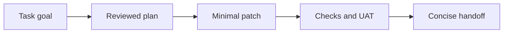

# Diagramming And Brand Colours

Chat and docs render Markdown `mermaid` code fences as diagrams. Use them when a small visual model makes a workflow, state machine, dependency graph, architecture, or handoff easier for a human or agent to understand.

## When To Diagram

- Prefer diagrams for state transitions, machine-to-machine flows, approval gates, retry paths, and multi-step operator workflows.
- Keep diagrams compact: one idea, meaningful labels, and no decorative branches.
- Use the same domain words as the surrounding docs or task summary so search and future agents can connect the diagram to the text.
- If Mermaid syntax fails, the dashboard shows the source block as a fallback; fix the syntax rather than replacing the diagram with an image.

## Brand Palette

The dashboard renderer applies the homelabd palette automatically to Mermaid diagrams. Do not add ad hoc Mermaid theme directives or custom colours unless they match these values.

Light palette:

- Background `#f5f7fb`, surface `#ffffff`, muted surface `#f8fafc`, hover surface `#eef5ff`
- Text `#172033`, strong text `#0f172a`, muted text `#64748b`
- Border `#cbd5e1`, soft border `#dbe3ef`
- Accent `#2563eb`, accent hover `#1d4ed8`
- Success `#bbf7d0`, warning `#fde68a`, danger `#991b1b`

Dark palette:

- Background `#0b1120`, surface `#172033`, muted surface `#1f2937`, hover surface `#243047`
- Text `#dbe7f6`, strong text `#f8fafc`, muted text `#9fb0c7`
- Border `#334155`, soft border `#263244`
- Accent `#60a5fa`, accent hover `#3b82f6`
- Success `#1f6f4a`, warning `#854d0e`, danger `#fecaca`

## Authoring Rules

- Write diagrams as fenced blocks labelled `mermaid`.
- Let the renderer supply light and dark colours. Avoid embedded `init` blocks unless the task explicitly requires a Mermaid option, and then keep colours aligned with the palette above.
- Use `flowchart` for task or system flows, `stateDiagram-v2` for lifecycles, `sequenceDiagram` for interactions, and `graph` for dependencies.
- Include a short text explanation before or after the diagram so the meaning remains available to search, screen readers, and plain-text tools.
