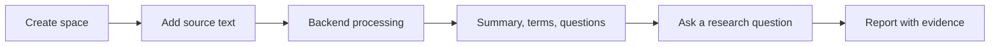

# Knowledge Space

Knowledge Space is the dashboard mode for source-grounded research work. It keeps source material, backend processing output, and generated reports in one durable place under `data/knowledge`.

## Workflow



## Behaviour

- A space stores a title, optional objective, processed sources, aggregate key terms, suggested questions, and recent reports.
- Adding a source stores a static copy of the supplied text. The backend normalises whitespace, counts words, extracts key terms, writes a short summary, and proposes source-specific questions.
- Running research is source-bound. The backend ranks matching source excerpts, writes a report answer with evidence labels, records coverage gaps, and saves the report back to the space.
- The dashboard page is `/knowledge`; direct links use `/knowledge?space=<space_id>`.

## Operator CLI

Use `homelabctl knowledge` for repeatable Knowledge Space setup and inspection instead of raw HTTP calls:

```bash
go run ./cmd/homelabctl knowledge create --objective "Collect source-grounded examples" "Example space"
go run ./cmd/homelabctl knowledge source add kspace_123 --file docs/knowledge-space.md "Knowledge Space docs"
go run ./cmd/homelabctl knowledge research kspace_123 --mode study "How should operators use this space?"
```

The CLI mirrors the dashboard flow: create a space, add one or more text/file sources, then run a research question against all or selected sources. See `docs/homelabctl.md#knowledge-space-commands` for the full command reference.

## HTTP API

- `GET /knowledge/spaces`: list spaces. An empty store returns `{"spaces":[]}` and the dashboard shows the empty state.
- `POST /knowledge/spaces`: create a space with `title`, optional `objective`, and optional `description`.
- `GET /knowledge/spaces/{space_id}`: load one space.
- `POST /knowledge/spaces/{space_id}/sources`: add and process a source with `title`, optional `kind`, optional `uri`, and `content`.
- `POST /knowledge/spaces/{space_id}/research`: create a report with `question`, optional `mode` (`research`, `brief`, or `study`), and optional `source_ids`.

## Operator Notes

Processing lives in `homelabd`, not in the browser. The dashboard only submits source text, chooses the selected sources, and renders the processed summaries, key terms, evidence, gaps, and saved reports returned by the API.

An empty Knowledge Space store is normal on a new install or after a data reset. The `/knowledge` page should show `0` spaces and `0` sources with the `New space` control; a raw `response.spaces is null` or iterator error is a bug, not an operator action.

The current implementation is deterministic and local to stored sources. Future work can add web retrieval, richer document parsing, collaboration, and export without changing the page model: sources enter the space, backend processing updates the space, and reports remain tied to evidence.
