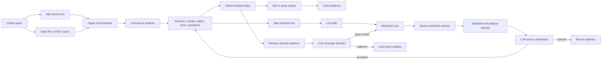

# Knowledge Space

Knowledge Space is the dashboard mode for source-grounded research work. It keeps source material, language-model analysis, corpus queries, grounded answers, research runs, and generated reports in one durable filesystem-backed place under `data/knowledge`.

## Workflow



## Behaviour

- A space stores a title, optional objective, processed sources, aggregate key terms, suggested questions, research runs, and recent reports.
- Operators can rename a space, edit its objective and description, delete a source from the active corpus, or delete an entire space. Deleting a source removes it from active retrieval and deletes its source snapshot; saved reports remain historical artefacts. Deleting a space removes its JSON record, source snapshots, retrieval index, and per-run workspaces.
- Adding a text, note, file, email export, connected-resource export, URL, or PDF URL stores a static source snapshot and provenance. URL ingestion extracts HTML, plain text, JSON/XML-like text, or PDF text server-side.
- Every ready source has ingestion state, provenance, content hash, snapshot path, word count, source sections, retrieval chunks, semantic chunk terms, and model-produced summary, key terms, questions, claims, entities, and reliability notes.
- Source analysis, grounded answers, report generation, and research planning require the configured `homelabd` language model provider. If the provider fails, the operation records or returns that failure instead of fabricating deterministic content.
- Querying the corpus is source-bound hybrid retrieval over stored chunks. It combines lexical matches from chunk text with semantic terms derived from section headings, source summaries, claims, entities, questions, and reliability notes. Asking the corpus sends ranked evidence to the configured model, saves the answer as an `ask` report artefact, and returns an answer with evidence labels, source sections, retrieval method, lexical and semantic scores, key findings, gaps, model, and token usage.
- Starting research records a durable queued run with objective, source selection, optional online discovery, lifecycle events, model plan, coverage, research loops, evidence counts, model provenance, candidate source state, workspace path, stop reason, and a linked report artefact when synthesis completes. Research advances asynchronously through queued, planning, discovering, retrieving, reading, synthesising, reviewing, completed, or failed states. When `homelabd` starts, it resumes queued or in-progress research, records a `recovered` lifecycle event, reuses existing plans and accepted discovery sources, and continues from the safest stage instead of leaving work stranded.
- When `discover_sources` is enabled, discovery is iterative. Each research loop sends planned or follow-up queries to the registered `internet.research` tool with fetched web and academic searches, preferring the apparent language of the operator objective and falling back to English when the language is unclear. The run preflights raw search results before they enter the candidate pool, filtering obvious adult or streaming-site noise, source-code hosts for non-software objectives, and results whose title, snippet, and URL do not overlap the research objective. It then analyses readable candidates, asks the model whether each reviewed source is useful, imports accepted candidates as URL sources, records rejected candidates, retrieves broader evidence from the selected corpus, then asks the model whether coverage is sufficient. If gaps remain, the model's follow-up queries start another loop. The run stops because coverage is sufficient, no productive follow-up query remains, or discovery cannot import usable evidence. Search, fetch, extraction, model, and import failures stay visible on the run; the executor does not substitute fabricated source content.
- Knowledge model calls use the same configured provider chain as chat. `homelabd` tries the default provider first, honours provider `Retry-After` rate-limit hints during retry, and uses a configured usable OpenAI-compatible provider only after the default provider remains unavailable. Gemini remains primary when it is the default provider.
- PDF URLs with readable embedded text are indexed directly. Unreadable embedded text, image-only PDFs, and scanned pages are rasterised with `pdftoppm` and recognised with `tesseract` when Knowledge OCR is enabled; missing OCR commands or unreadable pages fail explicitly and are not stored as placeholder text.
- Source snapshots are written under `data/knowledge/snapshots/<space_id>/`. The filesystem-backed retrieval index is written to `data/knowledge/indexes/<space_id>/chunks.json` with chunk IDs, source IDs, section headings, lexical terms, semantic terms, content hashes, and provenance pointers.
- Completed run workspaces under `data/knowledge/runs/<space_id>/<run_id>/` include `state.json`, `events.jsonl`, candidate source JSON, `loops.json`, and, when available, `coverage.json`, `evidence.json`, and `report.json`.
- The dashboard renders Markdown and Mermaid diagrams in objectives, source summaries, source content, answers, cited evidence, research events, gaps, and saved reports. Citation labels such as `[S1]` link back to the relevant source card when that source is still in the active corpus. Desktop keeps the space list and selected detail side by side. Mobile shows the selected space first with a compact corpus toolbar for switching, syncing, browsing, creating, and opening more space options; space search/list/create controls live in the browse panel, rename/delete/suggested questions live in the more panel. Source inventories, Ask evidence, Research diagnostics, previous research runs, and Reports supporting detail stay collapsed until the operator opens the relevant section or citation. Critical-thinking prompts such as suggested questions and gaps render as bullet lists with a small `Research this` action that starts a durable online research run. The Research tab shows the selected run as the primary result and keeps older runs inside the Previous research disclosure so historical runs do not look like duplicate current results. Long source Markdown, code, tables, and diagrams wrap inside the source card so the mobile Sources page keeps vertical scrolling only.
- The dashboard page is `/knowledge`; direct links use `/knowledge?space=<space_id>`.

## Operator CLI

Use `homelabctl knowledge` for repeatable Knowledge Space setup and inspection instead of raw HTTP calls:

```bash
go run ./cmd/homelabctl knowledge create --objective "Collect source-grounded examples" "Example space"
go run ./cmd/homelabctl knowledge update kspace_123 --title "Example corpus" --objective "Collect cited examples"
go run ./cmd/homelabctl knowledge source add kspace_123 --file docs/knowledge-space.md "Knowledge Space docs"
go run ./cmd/homelabctl knowledge source add kspace_123 --url https://example.com/research
go run ./cmd/homelabctl knowledge source delete kspace_123 ksrc_123
go run ./cmd/homelabctl knowledge query kspace_123 --limit 5 "evidence handling"
go run ./cmd/homelabctl knowledge ask kspace_123 "How should operators use this space?"
go run ./cmd/homelabctl knowledge research-run kspace_123 "Create a source-grounded briefing"
go run ./cmd/homelabctl knowledge research-run kspace_123 --discover "Research current source-grounded evidence patterns"
go run ./cmd/homelabctl knowledge delete kspace_123
```

The CLI mirrors the dashboard flow: create a space, add text/file/URL sources, query or ask the corpus, then start a research run against stored, selected, and optionally discovered online sources. See `docs/homelabctl.md#knowledge-space-commands` for the full command reference.

## PDF OCR Configuration

Knowledge PDF OCR is configured under `knowledge.ocr` in `config.json`. It is enabled by default and expects `pdftoppm` from Poppler plus `tesseract` on the supervised `homelabd` `PATH`; the Nix dev shell includes both tools. Tune `language`, `dpi`, `max_pages`, and `timeout_seconds` for the documents you expect to ingest:

```json
{
  "knowledge": {
    "ocr": {
      "enabled": true,
      "pdftoppm_command": "pdftoppm",
      "tesseract_command": "tesseract",
      "language": "eng",
      "dpi": 200,
      "max_pages": 25,
      "timeout_seconds": 600
    }
  }
}
```

## HTTP API

- `GET /knowledge/spaces`: list spaces. An empty store returns `{"spaces":[]}` and the dashboard shows the empty state.
- `POST /knowledge/spaces`: create a space with `title`, optional `objective`, and optional `description`.
- `GET /knowledge/spaces/{space_id}`: load one space.
- `PATCH /knowledge/spaces/{space_id}`: update a space title, objective, or description.
- `DELETE /knowledge/spaces/{space_id}`: delete the space record, source snapshots, retrieval index, and run workspaces.
- `POST /knowledge/spaces/{space_id}/sources`: add, snapshot, and analyse a source with `title`, optional `kind`, optional `uri`, and optional `content`. URL sources may omit `content` when `uri` is fetchable. Non-URL sources need source text.
- `DELETE /knowledge/spaces/{space_id}/sources/{source_id}`: delete a source from the active corpus and remove its snapshot. Historical reports are not rewritten.
- `POST /knowledge/spaces/{space_id}/query`: hybrid-search indexed source chunks with `query`, optional `limit`, and optional `source_ids`. Evidence includes source section, source summary, retrieval method, lexical score, semantic score, and total score.
- `POST /knowledge/spaces/{space_id}/ask`: answer a grounded question with `question`, optional `limit`, and optional `source_ids`. The response persists the answer as an `ask` report and returns `space`, `result`, `report`, evidence trace metadata, model provenance, and usage.
- `POST /knowledge/spaces/{space_id}/research`: create an immediate model-backed report with `question`, optional `mode` (`research`, `brief`, or `study`), and optional `source_ids`.
- `POST /knowledge/spaces/{space_id}/research-runs`: create durable asynchronous research with `objective`, optional `mode`, optional `source_ids`, and optional `discover_sources`. Low-level clients may still send `scope` and `depth`, but the dashboard starts from the operator objective and lets the model plan scope and effort. The create response returns the queued run; poll `GET /knowledge/spaces/{space_id}` for status, research loops, stop reason, coverage, candidate sources, workspace path, and report linkage.

## Operator Notes

Processing lives in `homelabd`, not in the browser. The dashboard submits source text or URL metadata, chooses selected sources, and renders ingestion status, provenance, model analysis, chunks, evidence, gaps, runs, plans, model usage, and saved artefacts returned by the API.

An empty Knowledge Space store is normal on a new install or after a data reset. The `/knowledge` page should show `0` spaces and `0` sources with the `New space` control; a raw `response.spaces is null` or iterator error is a bug, not an operator action.

The active implementation remains directory-backed JSON plus source snapshots, a filesystem-backed chunk index, and per-run workspaces behind the Knowledge repository interface. There is no SQLite dependency. Provider-native embeddings, OAuth connector pulls, hosted Deep Research adapters, and resumable multi-day schedulers are still extension points, but the production answer/report/source-analysis/research path is language-model backed.
