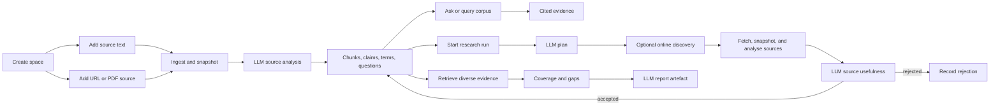

# Knowledge Space

Knowledge Space is the dashboard mode for source-grounded research work. It keeps source material, language-model analysis, corpus queries, grounded answers, research runs, and generated reports in one durable filesystem-backed place under `data/knowledge`.

## Workflow



## Behaviour

- A space stores a title, optional objective, processed sources, aggregate key terms, suggested questions, research runs, and recent reports.
- Adding a text, note, file, email export, connected-resource export, URL, or PDF URL stores a static source snapshot and provenance. URL ingestion extracts HTML, plain text, JSON/XML-like text, or PDF text server-side.
- Every ready source has ingestion state, provenance, content hash, snapshot path, word count, retrieval chunks, and model-produced summary, key terms, questions, claims, entities, and reliability notes.
- Source analysis, grounded answers, report generation, and research planning require the configured `homelabd` language model provider. If the provider fails, the operation records or returns that failure instead of fabricating deterministic content.
- Querying the corpus is source-bound lexical retrieval over stored chunks. Asking the corpus ranks matching chunks, sends them to the configured model, and returns an answer with evidence labels, key findings, gaps, model, and token usage.
- Starting a research run records a durable queued run with objective, scope, depth, source selection, optional online discovery, lifecycle events, model plan, coverage, evidence counts, model provenance, candidate source state, workspace path, and a linked report artefact when synthesis completes. Runs advance asynchronously through queued, planning, discovering, retrieving, reading, synthesising, reviewing, completed, or failed states. When `homelabd` starts, it resumes queued or in-progress runs, records a `recovered` lifecycle event, reuses existing plans and accepted discovery sources, and continues from the safest stage instead of leaving runs stranded.
- When `discover_sources` is enabled, the run sends the model-planned search queries to the registered `internet.research` tool with fetched web pages. It analyses each readable source, asks the model whether it is useful for the run, imports accepted or partial candidates as URL sources, records rejected candidates, retrieves broader evidence from the selected corpus, and synthesises over source summaries plus cited chunks. Search, fetch, extraction, model, and import failures stay visible on the run; the executor does not substitute fabricated source content.
- PDF URLs with embedded text are indexed directly. Image-only or scanned PDF pages are rasterised with `pdftoppm` and recognised with `tesseract` when Knowledge OCR is enabled; missing OCR commands or unreadable pages fail explicitly and are not stored as placeholder text.
- Completed run workspaces under `data/knowledge/runs/<space_id>/<run_id>/` include `state.json`, `events.jsonl`, candidate source JSON, and, when available, `coverage.json`, `evidence.json`, and `report.json`.
- The dashboard renders Markdown and Mermaid diagrams in objectives, source summaries, source content, answers, cited evidence, research run events, gaps, and saved artefacts.
- The dashboard page is `/knowledge`; direct links use `/knowledge?space=<space_id>`.

## Operator CLI

Use `homelabctl knowledge` for repeatable Knowledge Space setup and inspection instead of raw HTTP calls:

```bash
go run ./cmd/homelabctl knowledge create --objective "Collect source-grounded examples" "Example space"
go run ./cmd/homelabctl knowledge source add kspace_123 --file docs/knowledge-space.md "Knowledge Space docs"
go run ./cmd/homelabctl knowledge source add kspace_123 --url https://example.com/research
go run ./cmd/homelabctl knowledge query kspace_123 --limit 5 "evidence handling"
go run ./cmd/homelabctl knowledge ask kspace_123 "How should operators use this space?"
go run ./cmd/homelabctl knowledge research-run kspace_123 --depth standard --scope "stored sources" "Create a source-grounded briefing"
go run ./cmd/homelabctl knowledge research-run kspace_123 --discover --depth deep "Research current source-grounded evidence patterns"
```

The CLI mirrors the dashboard flow: create a space, add text/file/URL sources, query or ask the corpus, then start a research run against stored, selected, and optionally discovered online sources. See `docs/homelabctl.md#knowledge-space-commands` for the full command reference.

## PDF OCR Configuration

Knowledge PDF OCR is configured under `knowledge.ocr` in `config.json`. It is enabled by default and expects `pdftoppm` from Poppler plus `tesseract` on the supervised `homelabd` `PATH`; the Nix dev shell includes both tools. Tune `language`, `dpi`, `max_pages`, and `timeout_seconds` for the documents you expect to ingest:

```json
{
  "knowledge": {
    "ocr": {
      "enabled": true,
      "pdftoppm_command": "pdftoppm",
      "tesseract_command": "tesseract",
      "language": "eng",
      "dpi": 200,
      "max_pages": 25,
      "timeout_seconds": 600
    }
  }
}
```

## HTTP API

- `GET /knowledge/spaces`: list spaces. An empty store returns `{"spaces":[]}` and the dashboard shows the empty state.
- `POST /knowledge/spaces`: create a space with `title`, optional `objective`, and optional `description`.
- `GET /knowledge/spaces/{space_id}`: load one space.
- `POST /knowledge/spaces/{space_id}/sources`: add, snapshot, and analyse a source with `title`, optional `kind`, optional `uri`, and optional `content`. URL sources may omit `content` when `uri` is fetchable. Non-URL sources need source text.
- `POST /knowledge/spaces/{space_id}/query`: search indexed source chunks with `query`, optional `limit`, and optional `source_ids`.
- `POST /knowledge/spaces/{space_id}/ask`: answer a grounded question with `question`, optional `limit`, and optional `source_ids`. The response includes model provenance and usage.
- `POST /knowledge/spaces/{space_id}/research`: create an immediate model-backed report with `question`, optional `mode` (`research`, `brief`, or `study`), and optional `source_ids`.
- `POST /knowledge/spaces/{space_id}/research-runs`: create a durable asynchronous research run with `objective`, optional `scope`, optional `depth` (`quick`, `standard`, or `deep`), optional `mode`, optional `source_ids`, and optional `discover_sources`. The create response returns the queued run; poll `GET /knowledge/spaces/{space_id}` for status, coverage, candidate sources, workspace path, and report linkage.

## Operator Notes

Processing lives in `homelabd`, not in the browser. The dashboard submits source text or URL metadata, chooses selected sources, and renders ingestion status, provenance, model analysis, chunks, evidence, gaps, runs, plans, model usage, and saved artefacts returned by the API.

An empty Knowledge Space store is normal on a new install or after a data reset. The `/knowledge` page should show `0` spaces and `0` sources with the `New space` control; a raw `response.spaces is null` or iterator error is a bug, not an operator action.

The active implementation remains directory-backed JSON plus source snapshots plus per-run workspaces behind the Knowledge repository interface. There is no SQLite dependency. Semantic embeddings, OAuth connector pulls, hosted Deep Research adapters, and resumable multi-day schedulers are still extension points, but the production answer/report/source-analysis/research path is language-model backed.
