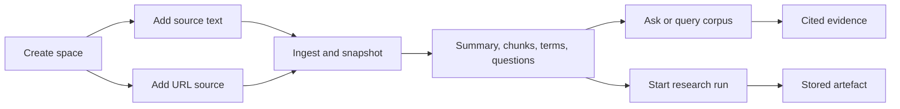

# Knowledge Space

Knowledge Space is the dashboard mode for source-grounded research work. It keeps source material, backend processing output, corpus queries, grounded answers, research runs, and generated reports in one durable filesystem-backed place under `data/knowledge`.

## Workflow



## Behaviour

- A space stores a title, optional objective, processed sources, aggregate key terms, suggested questions, research runs, and recent reports.
- Adding a text, note, or file source stores a static copy of the supplied text. Adding a URL source can fetch the page server-side, extract readable text, snapshot it, and record fetch provenance.
- Every indexed source has ingestion state, provenance, content hash, snapshot path, word count, summary, key terms, suggested questions, and retrieval chunks.
- Querying or asking the corpus is source-bound. The backend ranks matching chunks and returns evidence labels, excerpts, and coverage gaps. The current answer engine is deterministic and local, but the API shape is ready for an LLM/RAG provider.
- Starting a research run records a durable run with objective, scope, depth, source selection, lifecycle events, and a linked report artefact. In this pass runs complete synchronously over stored sources.
- The dashboard renders Markdown and Mermaid diagrams in objectives, source summaries, source content, answers, cited evidence, research run events, gaps, and saved artefacts.
- The dashboard page is `/knowledge`; direct links use `/knowledge?space=<space_id>`.

## Operator CLI

Use `homelabctl knowledge` for repeatable Knowledge Space setup and inspection instead of raw HTTP calls:

```bash
go run ./cmd/homelabctl knowledge create --objective "Collect source-grounded examples" "Example space"
go run ./cmd/homelabctl knowledge source add kspace_123 --file docs/knowledge-space.md "Knowledge Space docs"
go run ./cmd/homelabctl knowledge source add kspace_123 --url https://example.com/research
go run ./cmd/homelabctl knowledge query kspace_123 --limit 5 "evidence handling"
go run ./cmd/homelabctl knowledge ask kspace_123 "How should operators use this space?"
go run ./cmd/homelabctl knowledge research-run kspace_123 --depth standard --scope "stored sources" "Create a source-grounded briefing"
```

The CLI mirrors the dashboard flow: create a space, add text/file/URL sources, query or ask the corpus, then start a research run against all or selected sources. See `docs/homelabctl.md#knowledge-space-commands` for the full command reference.

## HTTP API

- `GET /knowledge/spaces`: list spaces. An empty store returns `{"spaces":[]}` and the dashboard shows the empty state.
- `POST /knowledge/spaces`: create a space with `title`, optional `objective`, and optional `description`.
- `GET /knowledge/spaces/{space_id}`: load one space.
- `POST /knowledge/spaces/{space_id}/sources`: add and index a source with `title`, optional `kind`, optional `uri`, and optional `content`. URL sources may omit `content` when `uri` is fetchable.
- `POST /knowledge/spaces/{space_id}/query`: search indexed source chunks with `query`, optional `limit`, and optional `source_ids`.
- `POST /knowledge/spaces/{space_id}/ask`: answer a grounded question with `question`, optional `limit`, and optional `source_ids`.
- `POST /knowledge/spaces/{space_id}/research`: create a report with `question`, optional `mode` (`research`, `brief`, or `study`), and optional `source_ids`.
- `POST /knowledge/spaces/{space_id}/research-runs`: create a durable research run with `objective`, optional `scope`, optional `depth` (`quick`, `standard`, or `deep`), optional `mode`, and optional `source_ids`.

## Operator Notes

Processing lives in `homelabd`, not in the browser. The dashboard submits source text or URL metadata, chooses selected sources, and renders ingestion status, provenance, summaries, chunks, evidence, gaps, runs, and saved artefacts returned by the API.

An empty Knowledge Space store is normal on a new install or after a data reset. The `/knowledge` page should show `0` spaces and `0` sources with the `New space` control; a raw `response.spaces is null` or iterator error is a bug, not an operator action.

The current implementation is deterministic and local to stored sources. URL ingestion supports HTML and plain text; PDF text extraction, OAuth connectors, hosted Deep Research adapters, semantic embeddings, and multi-day autonomous scheduling are extension points. The storage contract is abstracted behind the Knowledge repository interface while the active implementation remains directory-backed JSON plus source snapshots.
