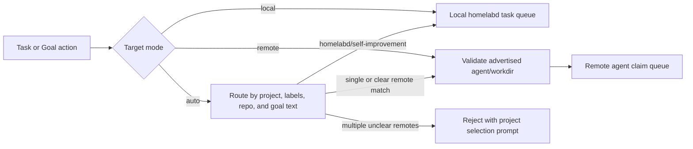

# Remote Agents

`homelabd` acts as the control plane for local and remote workers. A remote machine runs `homelab-agent`, which phones home to the `homelabd` HTTP API, advertises the exact directories it can work in, polls only for tasks assigned to that agent, runs the configured external worker command in the selected directory, and reports the result back to the task store.

The design intentionally treats remote machines as worker nodes:

- agent identity is stable and explicit (`agent_id`, machine, service instance)
- heartbeats drive readiness and health
- tasks are routed by target queue, not by a global repo
- local `homelabd` worktrees are never created for remote tasks
- remote review never compares the remote checkout to `homelabd`'s local `main`

## Control Plane

Set a shared token on the API server. Agent mutation endpoints reject requests when no token is configured.

```sh
export HOMELABD_AGENT_TOKEN='replace-with-a-long-random-token'
go run ./cmd/homelabd -mode http
```

Relevant config:

```json
{
  "control_plane": {
    "agent_token_env": "HOMELABD_AGENT_TOKEN",
    "agent_stale_seconds": 30
  }
}
```

The dashboard task page lists registered project workspaces and can create work as `Auto route`, `Local homelabd`, or `Remote project`. CLI usage is also available. Use `workspace list` to see the same inventory that the coordinator uses. Use `--project` for a project-level auto route, `--agent` plus `--workdir` for a specific remote queue, or `--workdir-path` only when the advertised path is the stable identifier.

```sh
homelabctl -addr http://127.0.0.1:18080 agent list
homelabctl -addr http://127.0.0.1:18080 workspace list
homelabctl -addr http://127.0.0.1:18080 task new --project remote1 "Build the reporting widget"
homelabctl -addr http://127.0.0.1:18080 task new --agent workstation --workdir repo "Update the service in this checkout"
```

The task page separates queues by execution target:

- `All queues`
- `Local homelabd`
- one queue per registered remote agent

When creating a remote task, the dashboard requires an explicit context confirmation that names the project, agent, machine, and full working directory path. If the target looks wrong, do not check that box. The API also resolves the selected workdir against the agent's advertised workdirs; an unknown workdir id/path is rejected instead of falling back to another checkout.

## Execution Targets

Every task and Goal can carry an execution target:

- `mode: "local"`: always use the local `homelabd` checkout. Use this for control-plane and self-improvement work.
- `mode: "remote"`: run in one advertised remote project workspace.
- `mode: "auto"`: let the coordinator choose. If one remote workspace is registered it is selected; if several exist, the goal text or `project_id` must clearly identify one. Ambiguous work is rejected instead of being sent to the wrong repository.



Remote workspaces include `project_id`, repository URL, branch, labels, and metadata. The coordinator copies that context into the task target, the remote assignment, and the worker instruction so a remote worker can name cross-project dependencies instead of guessing. If a task depends on another repository, the remote result should state the dependency, expected commit/version/API, and coordination order.

## Remote Worker

On a remote machine, run:

```sh
export HOMELABD_AGENT_TOKEN='same-token-as-control-plane'
go run ./cmd/homelab-agent \
  -api http://homelab:18080 \
  -id workstation \
  -name Workstation \
  -workdir repo=/home/me/project \
  -terminal-addr 0.0.0.0:18083 \
  -terminal-url http://workstation:18083
```

The agent uses the `external_agents` command for the assigned backend, defaulting to `codex`. It executes in the selected working directory, sends stdout/stderr back as the task result, and captures the remote git working-tree patch after completion. The captured patch includes uncommitted tracked changes and untracked files, excluding ignored runtime state such as `.agent-*`. Before calling back to `homelabd`, the agent writes the completion payload to `data/remote-agent/pending-completions/<agent_id>/` under its configured `data_dir`. If `homelabd` is restarting, offline, or returns a transient network error, the remote agent keeps advertising that task as current and replays the saved completion before claiming new work. A successful callback deletes the pending completion file. The same backend `timeout_seconds` applies to remote task execution; omitted or zero values default to 3,600 seconds, or 1 hour. If the worker reaches that deadline, the remote task is recorded as `timed_out` rather than `blocked` so the operator can retry with clearer instructions or a longer timeout. The default Codex backend disables Codex's own sandbox because local tasks already run in isolated worktrees and Codex otherwise may remount `.git` read-only, which prevents Git worktree metadata updates.

For tasks completed by an older agent that lost the callback before writing a pending completion file, use `homelabctl task recover-remote <task_id>` only when the remote workdir is accessible from the control plane. Pass `--base-ref` with the previous remote task snapshot tree or commit whenever possible so the recovered diff is task-scoped instead of a broad live checkout fallback.

Use `external_agents.<backend>.wrapper_command` and `wrapper_args` on each remote agent when a repository needs a custom shell before the CLI starts. The wrapper is agent-local configuration, not goal text. It receives `HOMELABD_WORKSPACE` and the backend command as arguments, so one machine can run a Nix-aware wrapper, another can use a VM bootstrap script, and a third can execute the CLI directly. A NixOS remote can use a repository script such as `/home/lab/remote1/scripts/agent-env`:

```json
{
  "external_agents": {
    "codex": {
      "command": "/nix/store/.../bin/codex",
      "args": ["--dangerously-bypass-approvals-and-sandbox", "exec", "--skip-git-repo-check"],
      "wrapper_command": "/home/lab/remote1/scripts/agent-env",
      "wrapper_args": []
    }
  }
}
```

Remote agents do not need to run in this repository. Each advertised `workdir` can be a different checkout, a different project, or a non-git directory. `homelabd` stores the path as execution context only; it does not assume that remote path has the same HEAD, branch, or repository root as the control-plane checkout.

Set `remote_agent.workdirs` explicitly on each worker. If no workdirs are configured, `homelab-agent` falls back to the configured `repo.root`, which is useful for local development but too easy to point at the wrong tree on a real machine.

```json
{
  "remote_agent": {
    "workdirs": [
      {
        "id": "remote1",
        "path": "/home/lab/remote1",
        "label": "Remote 1",
        "project_id": "remote1",
        "repo_url": "git@example.com:remote1.git",
        "branch": "main",
        "labels": ["uat", "node"]
      }
    ]
  }
}
```

Remote workers may include Mermaid fenced diagrams in reported results or docs when a workflow, state machine, architecture, sequence, or user journey would be clearer visually. Chat and dashboard docs render those diagrams with the homelabd brand theme and strip Mermaid init directives. Do not add Mermaid `init` blocks or hard-code unrelated colours; use the palette in `docs/chat-commands.md` when explicit semantic styling is unavoidable.

## Remote Testing

Remote agents validate in the selected remote workdir. They must not call the control-plane supervisor to restart production services, and they must not assume `127.0.0.1:5173` points at the operator's dashboard.

When remote handoffs describe multi-machine flows, state transitions, or verification paths, include a concise Mermaid diagram if it improves understanding. Diagrams must use the homelabd brand palette from `docs/diagramming-and-brand-colours.md`; the dashboard applies those colours automatically to Mermaid fences.

For focused UI/UX review in a remote checkout, run:

```sh
nix develop -c bun run --cwd web uat:ui
```

For dashboard task-page changes in a remote checkout, run:

```sh
nix develop -c bun run --cwd web uat:tasks
```

For broad dashboard shell, navigation, theme, terminal, docs, workflow, health, or supervisor changes, run:

```sh
nix develop -c bun run --cwd web uat:site
```

These commands start a Playwright-managed Vite server on that remote machine, choose a per-worktree port unless `PLAYWRIGHT_PORT` is set, and mock `homelabd` APIs. `uat:ui` runs desktop and mobile accessibility plus visual-baseline checks, and `uat:site` also mocks `healthd` and `supervisord`, covers every primary page on desktop and mobile, and attaches screenshots. The remote completion summary should include the command, the generated local URL when relevant, and whether Chromium came from `CHROME_BIN` or a Playwright browser install. If `browser:preflight` fails because the remote sandbox cannot launch Chromium, report that infrastructure failure instead of touching production services.

Use `uat:tasks:live` only when the operator explicitly asks the remote machine to verify a running dashboard URL.

## Remote Terminals

`homelab-agent` can optionally expose the same PTY terminal API as `homelabd`. Set `remote_agent.terminal_addr` or pass `-terminal-addr` to bind the local terminal server, and set `remote_agent.terminal_public_url` or `-terminal-url` to the browser-reachable base URL that should be advertised in heartbeats.

The dashboard Terminal page always offers `homelabd local`. Online remote agents are added to the session target picker when their heartbeat metadata contains `terminal_base_url`. Selecting a remote target and pressing the adjacent `+` button starts the PTY on that remote agent, not on the control plane.

Treat remote terminal URLs as trusted operator endpoints. They execute commands as the `homelab-agent` process user on the remote machine.

## healthd Integration

Every accepted remote-agent heartbeat is forwarded by `homelabd` into `healthd` as a process heartbeat named `remote-agent:<agent_id>` with type `remote_agent`. The process metadata includes:

- `agent_id`
- `machine`
- `service.name=homelab-agent`
- `service.instance.id=<agent_id>`
- advertised workdir count
- current task id, when one is running
- capability list

This makes remote agents visible on the Health page alongside `homelabd`, `supervisord`, and other processes. `GET /agents` marks an agent offline after `control_plane.agent_stale_seconds`; healthd receives the same value as the process heartbeat TTL and turns stale heartbeats into critical process check failures. Health forwarding is best-effort and does not block task scheduling if healthd is unavailable.

## supervisord Integration

The default supervisor config includes a non-autostart `homelab-agent` app template:

```json
{
  "name": "homelab-agent",
  "type": "agent",
  "command": "go",
  "args": ["run", "./cmd/homelab-agent"],
  "working_dir": ".",
  "auto_start": false,
  "restart": "always"
}
```

On machines where you want `supervisord` to keep the remote worker alive, set that app's `working_dir`, `remote_agent` config, and token environment, then set `auto_start` to `true`. The app does not need a `health_url`; health is reported by `homelab-agent` heartbeats that `homelabd` forwards to healthd.

Keep `auto_start` false on the control-plane machine unless it should also act as a worker.

## API Shape

- `GET /agents` lists known remote agents for the UI.
- `GET /workspaces` lists the project workspace inventory derived from remote-agent heartbeats.
- `GET /agents/{id}` returns one registered agent.
- `POST /agents/{id}/heartbeat` registers or refreshes an agent. `POST /agents` also accepts a heartbeat body with `id`.
- `POST /agents/{id}/claim` claims the next queued task targeted to that agent.
- `POST /agents/{id}/tasks/{task_id}/complete` records completion. Remote agents should report `completed`, `no_change_required`, `failed`, `blocked`, or `timed_out`. Duplicate completion posts for an already-recorded remote task are idempotent so an agent can delete a replayed pending completion after a coordinator restart.
- `POST /tasks` accepts an optional `target` object with `mode: "auto"`, `"local"`, or `"remote"`, plus `project_id`, `agent_id`, `workdir_id`, advertised `workdir`, `repo_url`, `branch`, labels, and `backend`.
- `POST /tasks/{task_id}/assign` retargets a non-terminal task to a remote agent and advertised workdir.

Remote tasks intentionally skip the local task supervisor. The selected remote agent owns execution until it reports completion or failure.

## Review Semantics

Local tasks still use local worktrees, local checks, diff review, and merge approval.

Remote tasks do not. For a remote task:

1. The remote agent records a task baseline for the selected remote directory.
2. The remote agent runs the worker in that directory.
3. The remote agent reports output, validation, and an immutable task-scoped diff snapshot back to `homelabd`.
4. `review <task>` runs a remote-result review and then moves the task to `awaiting_verification` only when there is independent evidence to inspect. For Goal-linked tasks, the reviewer compares the captured diff, changed files, validation evidence, and selected Goal phase before counting the work as progress. If the remote worker reports `No change required: <reason>` and no diff is available, `homelabd` records `no_change_required` instead so the operator can accept the no-change conclusion or reopen the task with corrected instructions. If there is no diff, missing validation, or a diff that does not align with the Goal, review blocks the task for rerun or reopening.
5. Human verification happens against the named remote machine/directory.
6. `accept <task>` closes it, or `reopen <task> <reason>` queues more remote work. Reopen reasons are operator instructions: the next remote assignment includes the latest `Reopen instruction from operator` block before the worker starts, matching `task retry` behaviour.

No local merge approval is created for remote tasks because the control plane cannot prove that the remote checkout corresponds to its own repo.

For Autopilot Goals, remote review uses the same independent-review transition as manual remote review. When the remote task reaches `ready_for_review` and the Goal policy allows `review_task`, `homelabd` reviews the captured remote evidence without consulting the local merge queue. The next `accept_task` gate can then close the task or pause/block according to the Goal policy. A worker `GOAL_REPORT` is treated as a claim, not proof: the stored Goal task report includes a reviewer decision such as `verified_progress`, `needs_validation`, `misaligned`, `insufficient_evidence`, or `no_change`.

Use `homelabctl task diff <task_id>` or the dashboard `Changes vs main` panel to inspect the task diff snapshot. New remote agents diff the worktree tree recorded before the assignment against the tree recorded after the assignment, so the saved patch belongs to that task even when the remote checkout already contains older uncommitted Goal work. The structured diff response includes `source`, `snapshot`, `captured_at`, and `sha256` provenance. If a completion predates task-scoped snapshots and the workdir path is still accessible from the control plane, `GET /tasks/{task_id}/diff` may compute a live remote working-tree fallback and marks it with a warning. If neither source is available, the task still shows the remote result and validation, but the diff panel tells the operator that no remote diff is available.

Build Goals should maintain a durable feature or parity matrix in the target repository. The worker prompt asks the agent to create or update that matrix, select one concrete slice, and report the files, validation, remaining gaps, blockers, and questions in the final `GOAL_REPORT:` line. This gives the supervisor a product scorecard instead of a stream of broad “continue building” tasks.
