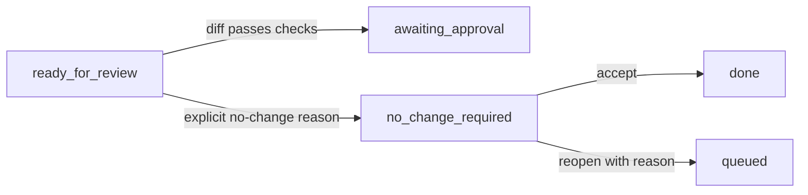
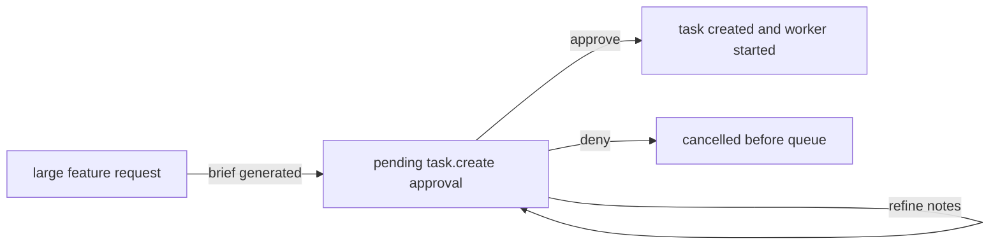

# Task Workflow

`homelabd` separates merge approval from final acceptance.

## States

- `queued`: task exists and is waiting for its execution queue. Local tasks wait for the local task supervisor; remote tasks wait for the selected `homelab-agent` queue. Next transition: `queued -> running`.
- `running`: a local in-memory worker or remote agent owns the task. Next transition: `running -> ready_for_review` when it finishes, `running -> timed_out` when the external worker reaches its configured deadline, or `running -> blocked` when another failure stops work.
- `ready_for_review`: local work is staged in the task worktree, or a remote agent result has been recorded for review. Local tasks enter the merge queue, and only the queue head can run review. Local next transition: `ready_for_review -> awaiting_approval` when checks and premerge pass, `ready_for_review -> conflict_resolution` when the task branch cannot reconcile with current `main`, or `ready_for_review -> blocked` for other failures. Remote next transition: `ready_for_review -> awaiting_verification` when review verifies the captured remote evidence, `ready_for_review -> no_change_required` for an explicit no-change result with no diff, or `ready_for_review -> blocked` when the diff, validation, or Goal alignment is insufficient.
- `conflict_resolution`: a local task branch conflicts with current `main` and needs fixes in the task worktree. The task supervisor queues automatic recovery with the preferred worker, up to three attempts with a short cooldown. Next transition: `conflict_resolution -> running` through automatic recovery, retry, or delegation; `conflict_resolution -> ready_for_review` after manual resolution; or deletion/cancellation.
- `timed_out`: an external local worker or remote agent reached `external_agents.<backend>.timeout_seconds`. This is distinct from `blocked` because the next decision is usually whether to retry with a larger timeout or narrower instructions, not whether product direction is missing. Next transition: `timed_out -> running` through `retry`, `delegate`, `run`, or `reopen`.
- `blocked`: review or execution stopped for a non-timeout reason. Retryable review-check, premerge, rebase, merge, and interrupted automatic recovery failures are automatically requeued by the task supervisor with bounded attempts. Dependency blocks and exhausted automatic recovery remain blocked for an operator decision. Next transition: `blocked -> running` through automatic recovery, `retry`, `delegate`, `run`, or `reopen`.
- `awaiting_approval`: checks and premerge passed and a merge approval exists. The approval remains in the merge queue and can merge only while the task is at the queue head. When approval is triggered, the Orchestrator first tries to reconcile the local task branch with current `main`. If an `awaiting_approval` task has no pending merge approval, the task supervisor requeues review so a fresh approval can be produced. Next transition: `awaiting_approval -> awaiting_restart` when the reviewed diff requires supervised component restarts, `awaiting_approval -> awaiting_verification` when no restart is required, `awaiting_approval -> conflict_resolution` if auto-rebase fails, `awaiting_approval -> blocked` for other merge failures, or `awaiting_approval -> running` when a worker retry starts. Starting that new run marks the old pending approvals stale.
- `awaiting_restart`: the merge has landed and `homelabd` is restarting required supervised components through `supervisord`. The task stays at the merge queue head and blocks later merges until the restart gate completes, because the running system has not been proven healthy yet. The task cannot be accepted while this gate is pending or running. Each component must restart and pass its configured health URL before the task moves to verification; a failed restart leaves the task in `awaiting_restart` with `restart_status=failed`, `restart_current`, and `restart_last_error` so the operator can retry with `restart <task_id>` or `homelabctl task restart <task_id>`. Failed restart gates are not retried automatically, because repeatedly restarting an unhealthy live component can extend an outage.
- `awaiting_verification`: local task merge has landed in the main repo, or remote task review acknowledged the remote result. The human still needs to verify the running app or the named remote machine/directory. Next transition: `awaiting_verification -> done` via `accept`, or `awaiting_verification -> queued` via `reopen`.
- `no_change_required`: the worker deliberately made no patch and reported `No change required: <reason>`, for example because a bug report is invalid, duplicated, unreproducible, already fixed, or outside the requested scope. Review records the conclusion without creating a merge approval. Next transition: `no_change_required -> done` via `accept`, or `no_change_required -> queued` via `reopen`.
- `done`: the human accepted the merged or no-change result. Terminal state.
- `cancelled`: work was intentionally stopped. Terminal state.



## Planning Gate

Every task record carries a durable reviewed plan before execution starts. The plan is stored in the task JSON under `plan` and is visible in the `/tasks` selected-task pane as a collapsible reviewed-plan section. The planning gate keeps the default inspect, change, validate, and handoff shape, then grounds local task plans with a lightweight repository scan. It searches the task title, goal, and acceptance criteria against source files, docs, and tests so the worker sees likely starting points before editing. Remote tasks and legacy graph phases still get target- or phase-specific plans. It records:

- a concise task-, phase-, or target-specific plan summary, including likely repo paths when the scan finds them
- ordered execution steps for the current task, legacy graph phase, or execution target
- likely code, docs, tests, and validation commands for local repository work
- known risks for that phase, target, or repo scan before work starts
- a reviewer note confirming the plan contains the required execution stages

`homelabd` writes `task.plan.created` and `task.plan.reviewed` events to the JSONL event log. If an older task has no reviewed plan, or only has the legacy generic or pre-scan default plan, `run` or `delegate` creates and reviews the current repo-aware plan before assigning the worker. The scan is a starting point only; workers must still inspect callers, imports, generated files, UI flows, and task state before editing.

Reviewing a task with no workspace diff moves it to `no_change_required` only when the worker result starts with `No change required:` and explains why. This gives the operator an explicit accept-or-reopen decision without forcing a diff. A no-diff task without that marker still moves to `blocked`; the next action should be to rerun, delegate with clearer instructions, or delete the task.

## Large Feature Planning Briefs

Large homelabd feature requests are approval-gated before the task queue. When a chat request looks like a new homelabd mode, major feature, or product surface, OrchestratorAgent writes a concise design brief instead of creating a task. The brief covers objectives, scope, UX direction, API changes, and test strategy, then creates a pending `task.create` approval. Use `approve <approval_id>` to create and run the implementation task, `refine <approval_id> <notes>` to revise the brief, or `deny <approval_id>` to cancel it.



No task record, worktree, worker run, or merge-queue entry exists before approval. Approved implementation tasks keep the accepted design brief in the task goal so the worker sees the objectives and validation strategy alongside the original request.

Task records include run lifecycle timestamps. `started_at` is set when a task enters `running`, and `stopped_at` is set when it leaves `running` for review, approval, verification, timed out, blocked, failed, done, or cancelled states. Reopening or rerunning a task starts a new run and clears the previous `stopped_at`.

The review gate records failure state and then exits; it does not restart a worker while ReviewerAgent owns the task. If checks or diff validation fail, the task stays `blocked`; if branch reconciliation fails, it moves to `conflict_resolution`. In either case, the failure reason is stored in the task result and task activity. The task supervisor owns follow-up recovery after review releases the task. When recovery starts, either automatically or through `retry`/`delegate`, `homelabd` preserves the previous failure context in the worker prompt and task result. For rebase or merge-conflict states, it also attempts to merge current `main` into a clean task worktree before starting the worker, leaving real conflict files in place for the worker to resolve.

Approvals are single-use decisions tied to the task state at the time they were requested. A merge approval for a task that is no longer `awaiting_approval` is stale and must not run. Retrying, delegating, assigning, reopening, refreshing, cancelling, or accepting a task stales its pending approvals; a later review also stales older pending approvals before requesting a new merge approval. If more than one pending merge approval exists for legacy data, only the newest one can run. When a merge approval is approved, the Orchestrator automatically merges current `main` into the task worktree before executing the approved merge. If that reconciliation conflicts, the approval is marked `failed`, the task moves to `conflict_resolution`, and the task supervisor queues automatic conflict recovery instead of returning a raw HTTP error. If an operator clicks a failed merge approval later, `homelabd` treats that as a recovery request: it queues automatic recovery or requeues review rather than reporting a dead approval as granted.

## Merge Queue

Local tasks in `ready_for_review`, `awaiting_approval`, or `awaiting_restart` are serialised through the merge queue. The queue stores `merge_queue_position` and `merge_queue_entered_at` on each task record, so order survives daemon restarts and dashboard refreshes. Only the head task is allowed to run review, create or consume a merge approval, apply the merge, and finish required restarts. If the head fails review, conflicts, blocks, or completes its restart gate, it leaves the queue and the next eligible task advances.

Operators can change priority without touching git history: use the compact merge queue in `/tasks` or run `homelabctl task queue <task_id> <up|down>`. Approving a non-head merge approval does not merge it; the approval stays pending and the reply tells the operator its current queue position. This keeps priority changes explicit and prevents later tasks from merging against a repository state that has not yet absorbed earlier queued work.

The `/tasks` merge-queue header includes an `Auto` switch. When enabled, `homelabd` grants the queue-head merge approval automatically after review passes. It does not skip review, queue order, pre-merge reconciliation, post-merge restart gates, or health checks. The same setting is available from `homelabctl settings auto-merge <on|off>` and is stored under `data/settings/runtime.json`.

## Task Records

New local development tasks are represented by one queued task record and one isolated worktree. Remote tasks are represented by one queued task record with an execution target instead of a local worktree. The target records `mode` (`auto`, `local`, or `remote`), project id, remote agent, machine, workdir id, workdir path, repo URL, branch, labels, backend, and route reason when applicable. Auto routing keeps homelabd self-improvement local, selects a single or clearly matched remote project workspace, and rejects ambiguous multi-project work until the operator names a project, agent, workdir, or label. The task keeps the original goal, reviewed plan, lifecycle timestamps, workspace or target path, and final result. The durable `title` is generated through the LLM-backed `text.summarize` tool with an 84-character task-pane limit, while `goal` preserves the full user input for execution context. Title summarisation removes leading task-creation sugar such as `new`, `task:`, or `create a task to` before generating the queue label, so direct API and dashboard-created tasks do not end up titled after the command word. Task creation chat replies stay intentionally brief for local tasks and include project, agent, workdir, and route reason for remote tasks. The task details carry the reviewed plan, workspace or remote target, branch, and follow-up actions. If the summariser cannot run, task creation continues with a clipped extractive fallback title from the requested work. `homelabd` no longer expands a new task into separate inspect, design, implement, test, docs, and review queue items.

Task records may also include `attachments`. Dashboard help reports use this for `browser-context.json` and screenshots; chat/task creation can attach uploaded files. Attachments store name, media type, byte size, optional text preview, and optional data URL content. The `/tasks` selected-task pane shows attachments in `State and context`, and worker prompts include attachment names plus text previews so evidence is not lost outside the UI.

Goal-linked tasks include `goal_id`, `goal_kind`, `execution_mode`, and the Goal target. `goal_kind` tells the UI and worker whether the work came from a Build, Routine, Watch, or Maintenance Goal. `execution_mode` distinguishes Guided tasks, where the operator remains responsible for approval and acceptance, from Autopilot tasks, where the Goal supervisor can create the next bounded task and pass applicable review, merge, restart, and acceptance gates when checks succeed. A remote Autopilot task is queued for the selected `homelab-agent`; it is not started by the local worker supervisor and it uses the remote review path instead of the local merge queue. The worker prompt receives the Goal objective, success criteria, constraints, autonomy, target context, and an explicit report-back contract. When the operator or Assistant Autopilot accepts the task, `homelabd` records a Goal progress note, updates linked task state, and extracts watch recommendations from concise result markers such as `goal.watch.recommend:` or `watch_recommendation:`. The stored Goal task report includes the worker claim plus a reviewer decision, so a diff is not automatically considered progress: repeated `no_change`, `insufficient_evidence`, or `misaligned` reports stop Autopilot, while diff-backed reports with validation and Goal alignment continue the plan. Once the plan is exhausted, Autopilot creates a final whole-goal audit task; only that audit can complete the Goal, and remote build audits must treat dirty or undelivered worktrees as delivery gaps. Use Goal-linked tasks when a durable objective needs concrete work while preserving the larger desire and its future checks.

Task detail may include `goal_blocker_trace` when the linked Goal is blocked. This is derived from the Goal plan, supervisor decisions, open questions, and structured task reports, not from the task status alone. A task can be `done` or `ready_for_review` and still be the blocker if its accepted report says validation is missing, a question is unanswered, or the reviewer marked progress as misaligned. The trace includes a resolver: `human` means the operator must decide or provide something, `agent` means the next step is autonomous repair work, and `external` means the system is waiting on an outside condition. The dashboard shows the trace in the task context panel with the blocking reason, resolver-owned next action, phase, evidence, and links back to the Goal or blocking task. If the selected task is only waiting on another task, the panel says to open the blocking task. If the selected task is the blocker, the panel names the required decision or autonomous next step and keeps the relevant task action visible: retry or reopen active failures, accept or reopen reviewable results, a closed-task answer flow, or `Let Autopilot repair` when no human decision is required.

Closed blocker tasks use explicit choices instead of a bare resume button:

- `Accept current evidence`: confirms the blocker is acceptable and resumes Goal Autopilot.
- `Not acceptable: require more work`: pre-fills a reopen instruction that tells the next worker not to resume the Goal until the stricter missing evidence, comparison, implementation, or product decision is complete.
- `Answer another way`: opens the same reopen path with an empty instruction for a custom operator answer.

Use the reject paths when the worker asks a product question and the answer is "no". For example, if a validation Goal asks whether it may skip comparison against a licensed enterprise reference, choose `Not acceptable: require more work` and submit the instruction. Reopening moves the task back to the remote or local queue with that answer appended to the task result.

Use `show <task_id>` to inspect the task, `run <task_id>` to start the built-in coder, `retry <task_id> codex <instruction>` to force a recovery attempt with preserved failure context, `delegate <task_id> to codex` to use an external worker directly, `restart <task_id>` to retry a failed post-merge restart gate, and `accept <task_id>` after verification or no-change review is available. In the dashboard, `/tasks` exposes typed buttons for run, review, approval, post-merge restart retry, merge queue reorder, accept, reopen, cancel, retry, and delete; those buttons call HTTP endpoints directly rather than sending task commands through chat. Automatic recovery attempts are shown in the selected task state so an operator can follow the rebase queue without babysitting every retry. Long diagnostics such as worker output, activity, the reviewed plan, restart status, no-change reasons, and the original prompt are collapsible so they remain available without dominating the decision flow.

Older task records may still contain graph metadata from the previous workflow:

- `parent_id`: parent task for a legacy child phase.
- `depends_on`: task IDs that must be accepted before a legacy phase can run.
- `blocked_by`: currently unresolved dependency task IDs.
- `graph_phase`: legacy phase name such as `root`, `inspect`, `design`, `implement`, `test`, `docs`, or `review`.
- `acceptance_criteria`: durable checklist items for the task or legacy phase.

## Verification Commands

Use `accept <task_id>` after checking that the merged change works, or after agreeing with a `no_change_required` conclusion. If the task is `awaiting_restart`, acceptance is rejected until the required restart gate has completed and the task has moved to `awaiting_verification`.

Use `reopen <task_id> <reason>` when the merged change needs more work, for example:

```text
reopen 28493611 needs rework
```

Reopening moves the task back to `queued` and preserves the reason in the task result.

For command-line operation, use `homelabctl` rather than raw HTTP calls:

```bash
go run ./cmd/homelabctl status
go run ./cmd/homelabctl task show <task_id>
go run ./cmd/homelabctl workspace list
go run ./cmd/homelabctl task new --project remote1 "Build the remote1 feature"
go run ./cmd/homelabctl task new --attach ./browser-context.json "Fix the bug shown in the attachment"
go run ./cmd/homelabctl task runs <task_id>
go run ./cmd/homelabctl task diff <task_id>
go run ./cmd/homelabctl task review <task_id>
go run ./cmd/homelabctl task queue <task_id> up
go run ./cmd/homelabctl approve <approval_id>
go run ./cmd/homelabctl task restart <task_id>
go run ./cmd/homelabctl task accept <task_id>
go run ./cmd/homelabctl task reopen <task_id> "needs rework"
go run ./cmd/homelabctl task delete <task_id>
```

See `docs/homelabctl.md` for the full CLI command surface and the rule that new operator workflows must keep the CLI up to date.

## Agentic Testing

Agent validation must not interrupt the production dashboard or `homelabd` stack. Browser UAT runs from the task worktree with an isolated Playwright/Vite server; agents must not restart `dashboard`, `homelabd`, `healthd`, or `supervisord` to prove their changes.

For dashboard task-page changes, use:

```bash
nix develop -c bun run --cwd web uat:tasks
```

For broad dashboard shell, navigation, theme, terminal, docs, workflow, health, or supervisor changes, use:

```bash
nix develop -c bun run --cwd web uat:site
```

Both commands use mocked APIs and a per-worktree port, so concurrent local or remote agents do not share a dashboard process. The review gate runs task-page UAT for task-page-only diffs and site-wide UAT for shared UI, shell, route, Playwright, or browser tooling diffs. See `docs/agentic-testing.md` for the full SDLC and browser reliability notes.

For focused UI/UX review, use:

```bash
nix develop -c bun run --cwd web uat:ui
```

Browser-visible diffs must also pass the ReviewerAgent UI/UX gate: reviewed UI/UX brief, desktop and mobile UAT, desktop and mobile accessibility checks, and desktop and mobile screenshot or visual-baseline review.

## Diff Review

Use `diff <task_id>` or `homelabctl task diff <task_id>` when an operator asks what a task changes. The HTTP endpoint is `GET /tasks/{task_id}/diff`; it returns the raw patch, file stats, labels, refs when available, per-file summaries, and provenance fields such as `source`, `snapshot`, `captured_at`, `sha256`, and `warning`.

The dashboard `/tasks` selected-task record renders the same data in the `Changes vs main` panel. Reviewed local git tasks store an immutable review snapshot before merge approval so the historical patch remains available after merge and accept. New remote tasks store an immutable task-scoped snapshot built from the remote worktree tree before and after the assignment, including untracked files but excluding agent telemetry paths. Older records can fall back to a live branch or remote worktree diff; those responses are labelled with a warning because later work may have changed the checkout. The panel provides provenance, changed-file navigation, split and unified views with line numbers, wrapped long lines, and inline changed-text highlights.

Natural questions like `what is the diff between c01777ee and main?` are handled by the Orchestrator as program commands. The reply gives a compact summary and points to the dashboard or `homelabctl task diff`; it should not fall back to an LLM that lacks repository access.

## Restart Recovery

On startup, `homelabd` scans durable task records. Any task still marked `running` is treated as interrupted in-memory work and is automatically resumed:

- tasks assigned to `codex`, `claude`, or `gemini` restart on the same external backend
- tasks assigned to `CoderAgent` restart through the built-in coder loop
- tasks assigned to `UXAgent` restart through the built-in UX loop so UI research, tests, and browser-UAT expectations are preserved
- tasks assigned to `OrchestratorAgent` prefer `codex` when it is configured, otherwise they use `CoderAgent`

If a legacy task is still marked `running` but already has a granted `git.merge_approved` approval, recovery treats the merge as landed and moves the task to `awaiting_verification` instead of starting another worker.

If a restart-required task is still `awaiting_restart` after `homelabd` restarts, recovery continues the post-merge restart gate from the durable task record while the gate is pending or running. A `homelabd` self-restart is recorded before the process exits; the next process marks that component complete and continues with any remaining components. If the durable gate is already `failed`, recovery leaves it pinned at the merge queue head for explicit operator retry instead of starting another production restart.

Remote tasks are excluded from local restart recovery. A remote task stays in its target queue for the selected `homelab-agent`, and a running remote task is completed or failed only by that agent's completion callback.

Recovery decisions are written to the JSONL event log as `task.recovery.*` events and to the daemon logs with structured `slog` fields including task ID, short ID, title, workspace, strategy, and backend.

## Agent Completion Expectations

When a task changes user-facing behavior, commands, UI, configuration, tools, or workflow, the worker must update relevant docs or help text in the same patch.

When a task changes UI/UX, the worker must follow `docs/ui-ux-agent-work.md`: define the design brief before editing, reuse existing dashboard patterns from `docs/ui-pattern-catalogue.md`, cover relevant interaction states, run isolated browser UAT, inspect screenshots or visual baselines, and report the exact interaction and viewport coverage in the handoff.

Agents should include Mermaid fenced diagrams when a compact state machine, dependency graph, architecture map, or handoff diagram would improve human or machine understanding. Use the homelabd brand diagram palette documented in `AGENTS.md` and avoid diagram-level Mermaid init directives that override the shared theme.

When an external coding worker finishes a local task, `homelabd` automatically runs the review gate. Review normally runs for `ready_for_review` tasks and temporarily owns the task while checks run, so a retry or worker cannot mutate the same workspace underneath ReviewerAgent. A blocked task whose result starts with `ReviewerAgent checks failed:` can be reviewed again after a test-infrastructure fix without starting another worker. If the task changes state during a long review, the review result is ignored and no approval or block state is written. The review gate runs project checks, verifies the task branch can merge cleanly into the current repository state, stales any older pending approvals for the task, and only then creates a merge approval. Bun checks use the repo's Nix dev shell when a `flake.nix` is present, so ReviewerAgent gets the same Bun, Playwright, Chromium, and shared-library environment as the documented worker commands. Check failures name the failing tool, for example `bun.uat.site`, and keep the failing output tail visible. A task branch that cannot merge cleanly moves to `conflict_resolution` with an explicit premerge failure; approval is not created, recovery is handed to the task supervisor after review releases the task, and the main repository must not be left in a conflicted state. That recovery prepares the isolated worktree, not the main repository, so the next worker sees the unresolved files instead of a clean but still-stale branch.

When a remote agent finishes, `homelabd` records the remote result, stores the captured remote diff when available, and moves the task to `ready_for_review`. Reviewing a remote task inspects the captured remote evidence and moves it to `awaiting_verification` only when there is a reviewable result; it does not run local project checks, compare local and remote `HEAD`, create a merge approval, or touch the control-plane checkout. If the task belongs to a running Autopilot Goal and `review_task` is allowed, the Goal reconciler performs this remote review directly; it must not wait for the local merge queue because remote tasks never enter that queue.

External worker completions are ignored once the task has advanced to merge approval, merged verification, done, or cancelled. Remote completion callbacks are accepted only while the matching remote task is still `running`. This prevents a stale background worker from moving an already merged or accepted task back to review.

Final task summaries should include:

- changed files
- validation run
- how to use the change
- docs updated, or why no docs change was needed

See `docs/agent-tools.md` for the full agent tool catalogue, argument reference, risk model, and current limits.

## Repository Agent Tools

Agents inspect code with `repo.list`, `repo.read`, `repo.search`, and `repo.current_diff`. `repo.search` is the default code-search tool: it returns repository-relative paths, matched line numbers, and bounded grep-like context. Use `workspace` for task worktrees, `path` to narrow scope, `context_lines` to tune surrounding lines, and `max_results` to keep prompts small.

Coder and UX agents create or edit files in isolated task worktrees with `repo.write_patch`. The patch is a unified diff against repository-relative paths, so it can add new files and modify existing files without touching the live checkout.

## Git Agent Tools

Agents can inspect repository state with `git.status`, `git.diff`, `git.branch`, `git.describe`, `git.log`, and `git.show`.

Write workflow tools are available for explicit git operations:

- `git.commit` stages selected paths or all changes and creates a commit
- `git.revert` reverts a commit, optionally with `--no-commit`
- `git.merge` merges a branch or commit into the current branch

These write tools are high-risk and approval-gated by default. Task review still uses `git.merge_approved` for the normal reviewed-task merge path.

## Shell Agent Tools

`shell.run_limited` executes one allowlisted command array without shell expansion. `shell.run_chain` executes multiple allowlisted command arrays in order and stops at the first failure, giving agents `&&`-style sequencing without shell parsing. Read-only inspection and search commands such as `pwd`, `ls`, `find`, `grep`, `rg`, `cat`, `wc`, `head`, and `tail` are available for task worktrees, along with routine build/test commands. `find` execution hooks and `rg --pre` preprocessors are rejected. Potentially destructive allowlisted commands, including `rm`, `rmdir`, `mv`, `cp`, `git clean`, `git reset`, `git restore`, `git rm`, and `git checkout -- <path>`, are classified as high risk by the tool policy and create an approval request before execution.

Review pending shell requests with `approvals`, then use `approve <approval_id>` or `deny <approval_id>`.

## Restart Impact

Local review reports a restart impact line from the diff. Runtime, supervisor, healthd, and dashboard paths are mapped to their supervised components and stored on the task as `restart_required`, with the same list copied into the merge approval payload. After approval, `homelabd` moves the task to `awaiting_restart`, calls `supervisord` restart endpoints for each required component, waits for configured health URLs to return 2xx, and only then moves the task to `awaiting_verification`. `accept` is blocked while the restart gate is pending, running, or failed.

Restarting a supervised app also applies its configured runtime preparation. The default dashboard app runs `bun install --frozen-lockfile` from `web/` before Vite starts, so dependency or lockfile changes from an approved merge are applied to the live checkout before health checks can pass.

`supervisord` treats non-2xx app health checks as failed, so a dashboard that starts returning 500s after a merge is restarted instead of remaining up in a broken Vite SSR state. Remote review cannot infer restart impact from the control-plane diff; verify the named remote machine and directory directly before accepting.
