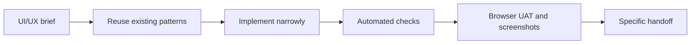

# UI/UX Agent Work

Agents must make dashboard UI changes from a clear design contract, not from trial and error. This workflow keeps homelabd UI work stable, reviewable, accessible, and easier for operators to verify.

## When To Use This

Use this workflow for any change that alters dashboard layout, navigation, controls, visual hierarchy, content density, theme behaviour, responsive behaviour, or user-facing interaction. Documentation-only changes require documentation review; they require browser UAT when they change dashboard rendering code or the task asks for visual verification.

## Required Workflow



Before editing UI code, write or preserve a compact brief in the task notes, implementation summary, or relevant issue context. The brief must name:

- operator goal and primary workflow
- page or component surfaces that will change
- existing dashboard pattern, component, token, or doc being reused
- desktop and mobile layout approach
- states to support: loading, empty, error, disabled, long content, success, and stale or reconnecting data
- accessibility risks, including focus order, focus visibility, keyboard access, colour contrast, target size, and reduced reliance on colour alone
- validation command and browser interaction that will prove the change

If the task has a design source, inspect it first. Use local documentation, existing dashboard pages, screenshots from prior UAT, component stories or equivalent fixtures, and Figma links that exist for the task. The agent must explain which source it used.

## Implementation Standards

Use the dashboard's existing interaction model before adding a new one:

- shared responsive navbar and flat top-level destinations
- existing CSS variables and semantic colour roles
- list-detail patterns for task, knowledge, workflow, and terminal records
- visible status text paired with colour, never colour-only state
- compact controls for operational tools, with clear labels or accessible names
- stable dimensions for fixed controls, badges, tabs, panes, and scroll regions
- plain-language errors with a recovery path

Operational pages must stay scan-friendly. Use restrained surfaces, predictable navigation, compact status summaries, and clear primary actions. Remove or avoid decorative content when it competes with task state, health state, terminal state, documentation, or workflow state.

## Regression Coverage

Every UI bug fix must include automated coverage for the behaviour that failed. Tests must exercise the user's interaction rather than checking implementation strings.

Required coverage includes:

- role, label, and visible text assertions
- button enabled or disabled states
- selected item and URL state changes
- keyboard focus and focus-not-obscured checks for interactive surfaces
- mocked loading, empty, error, and long-content states
- desktop and mobile viewport assertions
- horizontal overflow, clipped-control, and navbar-overlap checks
- accessibility scans with axe for changed surfaces on both desktop and mobile
- Playwright visual comparisons for stable, deterministic surfaces on both desktop and mobile
- attached or inspected screenshots plus explicit layout assertions for volatile surfaces on both desktop and mobile

Use screenshot baselines for stable shell, navigation, and component states on both desktop and mobile. When the page contains volatile timestamps, terminal output, charts, animations, or remote data, mask or stabilise volatile regions. If a surface still cannot be made deterministic, the task must attach or inspect screenshots and add explicit assertions for the visible layout, overflow, clipping, and interaction state on both desktop and mobile.

## Browser UAT

UI work is not done from compile or unit checks alone. Use the isolated browser commands documented in `docs/agentic-testing.md`.

For task-page changes:

```bash
nix develop -c bun run --cwd web uat:tasks
```

For dashboard shell, navigation, theme, terminal, docs, workflow, health, or supervisor changes:

```bash
nix develop -c bun run --cwd web uat:site
```

The browser check must exercise the reported or changed interaction, not just load the page. Inspect the screenshots produced by UAT on both desktop and mobile. Stable, deterministic states must use visual comparisons on both desktop and mobile.

If headless Chromium cannot launch, run:

```bash
nix develop -c bun run --cwd web browser:preflight
```

Treat browser launch failure as test infrastructure to fix or move to a browser-capable worker. Do not validate UI work by restarting production services.

## Handoff Checklist

The final task handoff for UI work must state:

- design source or existing pattern used
- files changed
- automated tests and browser/UAT command run
- exact interaction exercised
- desktop and mobile viewport coverage
- desktop and mobile accessibility checks performed
- desktop and mobile screenshot or visual-baseline review performed
- docs updated
- residual risk, especially for responsive layout, focus behaviour, long content, and theme contrast

## Required Tooling

UI tasks must satisfy these quality gates:

- shared component changes must include a component-level reference: Storybook story, equivalent docs entry, or focused fixture/test with usage notes
- changed browser-visible surfaces must run automated accessibility checks with `@axe-core/playwright` or an equivalent axe-powered Playwright scan on both desktop and mobile
- deterministic shell, navigation, and component states must use Playwright `toHaveScreenshot()` visual baselines on both desktop and mobile
- Figma MCP or linked Figma frames must be inspected when a Figma design source exists
- dashboard colours, spacing, radius, typography, focus rings, shadows, and state roles must be taken from a token reference or documented in the same change before use

## Related Links

- `AGENTS.md` for Definition of Done and mandatory UI handoff requirements
- `docs/dashboard.md` for dashboard surface, navigation, layout, and brand guidance
- `docs/agentic-testing.md` for isolated browser UAT commands
- Playwright visual comparisons: https://playwright.dev/docs/test-snapshots
- Playwright accessibility testing: https://playwright.dev/docs/accessibility-testing
- WCAG 2.2: https://www.w3.org/TR/wcag/
- Nielsen Norman Group usability heuristics: https://www.nngroup.com/articles/ten-usability-heuristics/
- Storybook AI and MCP guidance: https://storybook.js.org/docs/ai/mcp/overview
- Figma MCP server guide: https://help.figma.com/hc/en-us/articles/32132100833559-Guide-to-the-Figma-MCP-server
